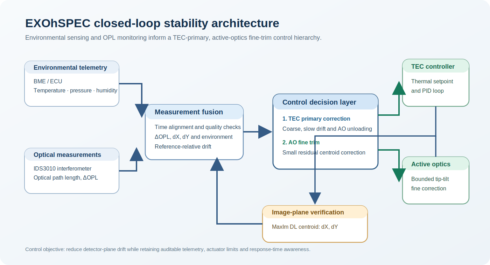
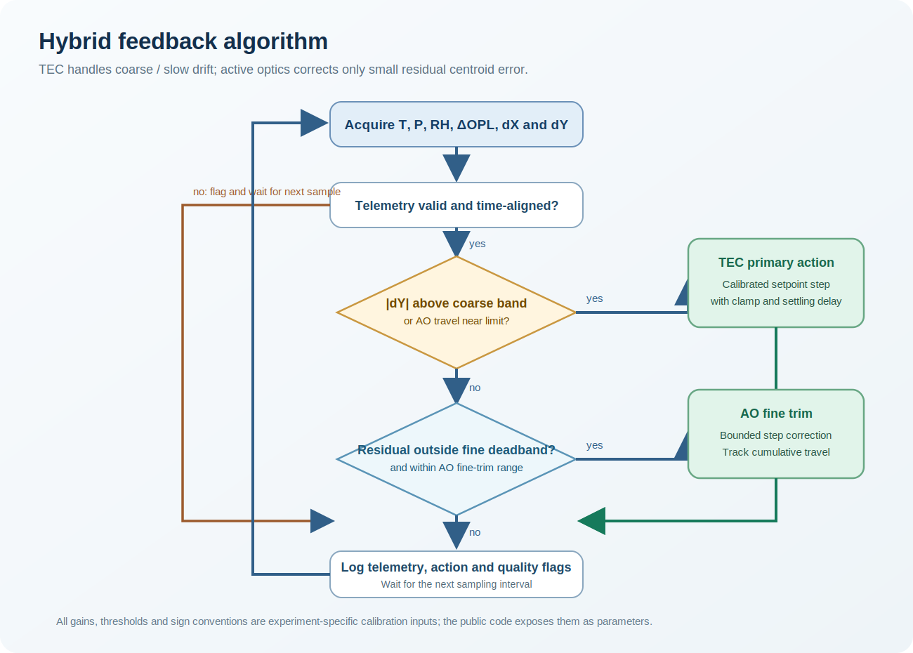

# Closed-Loop Feedback Control System for EXOhSPEC

  

**MSc Astrophysics Thesis and Selected Instrumentation Development**  
University of Hertfordshire · 2024

**Author:** Biswajit Jana  
**Supervisors:** Prof Hugh R. A. Jones and Prof Bill Martin

## Research question

EXOhSPEC is a high-resolution spectrograph development platform for precision radial-velocity work. This project investigated how temperature, pressure and humidity affect optical path length (OPL) and detector-plane motion, and whether feedback control can reduce spectral-image drift.

The experimental workflow combines environmental telemetry, IDS3010 interferometry, MaxIm DL centroid measurement, thermal control through a Meerstetter TEC controller, and bounded active-optics correction.

## Feedback architecture

  

The control hierarchy is TEC-primary: thermal correction is used for coarse and slow drift, while active optics is used only for small residual image motion. Cumulative AO travel is monitored so that the thermal loop can absorb an offset before the fine actuator reaches its range limit.

## Selected results

  

Selected experiments measured OPL sensitivity to environmental change, millikelvin-level TEC stability during a 44.5 h run, active-optics centroid response, and a hybrid-control comparison in which `dY` RMS decreased from 2.72 px to 0.69 px. See [`results/README.md`](results/README.md).

## Code

- [`tec_temperature_monitor.py`](code/tec_temperature_monitor.py) - portable Meerstetter TEC temperature logger, adapted from the thesis development notebook.
- [`hybrid_feedback_model.py`](code/hybrid_feedback_model.py) - hardware-independent TEC-primary / AO-fine-trim decision logic.
- [`drift_metrics.py`](code/drift_metrics.py) - RMS, mean-absolute-error and threshold-fraction summaries for reference-relative centroid drift.

The public code exposes the method and its calibration inputs. Device ports, credentials, raw telemetry and laboratory configuration are not included.

## Presentations

- [State of Art: Radial Velocity Spectrograph](Poster%20Presentation%20and%20Seminar/Seminar1-State%20of%20Art_%20Radial%20Velocity%20Spectrograph.pdf)
- [Advancements in Precision: LASER Interferometer Control System](Poster%20Presentation%20and%20Seminar/Seminar%202%20-%20Advancements%20in%20Precision_LASER%20Interferometer%20Control%20Systempdf.pdf)
- [Optimising Path Length Stability in Laser Interferometers using Air Refractive Index](Poster%20Presentation%20and%20Seminar/Seminar%203%20-%20Optimizing%20Path%20Length%20Stability%20in%20Laser%20Interferometers%20using%20Air%20Refractive%20Index.pdf)
- [High-Resolution RV Spectrographs: ANDES and PID Loop Implementation in EXOhSPEC](Poster%20Presentation%20and%20Seminar/Seminar%204%20-High-Resolution%20RV%20Spectrographs_ANDES%20and%20PID%20Loop%20Implementation%20in%20EXOhSPEC%20.pdf)

## Scope

This public repository contains selected methods, figures, code and MSc presentation material. The full working archive, raw data, laboratory configuration, detailed controller variants and unsubmitted material are kept separately.
