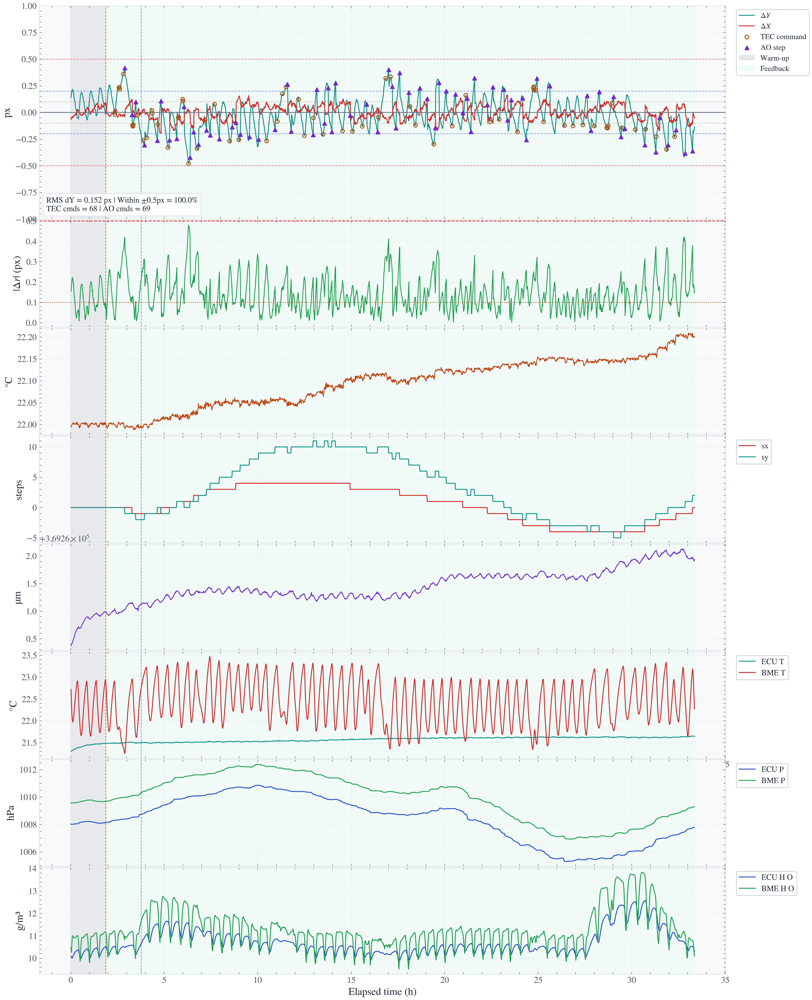
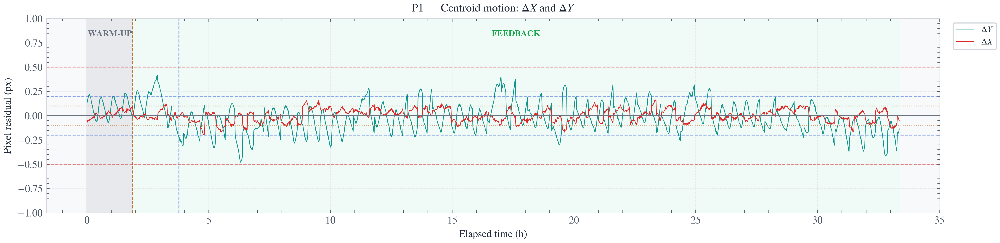
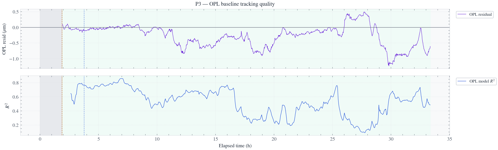
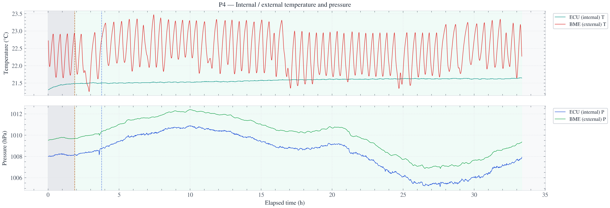
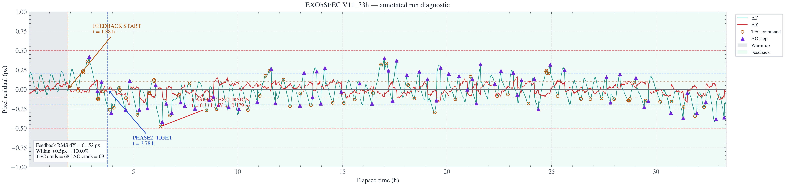

# EXOhSPEC-CLFCD — Closed-Loop Feedback Control Development

**MSc thesis (2024) + continuing EXOhSPEC instrumentation research record (2026)**  
**Author:** Biswajit Jana  
**Supervisors:** Prof Hugh R. A. Jones and Prof William E. Martin  
**University of Hertfordshire**

## [Open the EXOhSPEC scientific website →](https://biswajit1999.github.io/Master-Thesis-2024/new%20website%20made%20on%206th%20october/)

The GitHub Pages root for this repository also redirects to the programme website.

[Audit the report-derived runtime ledger →](https://biswajit1999.github.io/Master-Thesis-2024/new%20website%20made%20on%206th%20october/closed-loop/experiment-ledger.html) — each included interval retains its duration basis and source; unresolved candidates remain excluded pending raw-log reconciliation.

This repository follows one experimental question from the original MSc project into the current Stage-2 programme:

> How do environmental and thermal disturbances propagate into optical-path and detector-plane motion in EXOhSPEC, and how far can thermal control plus bounded active optics suppress that motion?

The 2024 submitted thesis is preserved as a historical document. The later V11–V24 experiments are recorded as a continuation rather than retroactively rewriting the examined thesis. V25 is the next hardware-validation phase and does not yet have a performance result.

  

## Where the research is now — October 2026

| Stage | Main result | What it means |
|---|---|---|
| **V17 endurance** | 88.59 h settled feedback, 4,761 frames; dX RMS 0.0594 px, dY RMS 0.1631 px; 100% within ±0.5 px | Demonstrated sustained sub-pixel operation over a multi-day run. |
| **V18.1** | 3.98 h feedback; dX RMS 0.0564 px, dY RMS 0.1073 px | Phase-correlation tracking and faster AO activation tightened the short-run result. |
| **V18.2** | 3.98 h feedback; dX RMS 0.0373 px, dY RMS 0.0990 px, radial RMS 0.1058 px | Multi-line ThAr phase correlation, PT104 integration and no-rewind AO logic reached the strongest reported short-run detector-plane result in this sequence. |
| **V19–V21 diagnosis** | V19 passive 5 h run showed a recurring ~33.4 min component across room/chiller/camera/OPL/dY telemetry | Shifted the programme from controller tuning alone toward physical thermal-path diagnosis; it is not a unique root-cause proof. |
| **V22 replacement LK220** | With camera TEC ON: dY RMS 0.2125 px and 100% within ±0.5 px; switching the camera TEC OFF reduced cooling load but produced a large thermo-optical transition | The camera TEC is a substantial heat load, but its removal is not an acceptable stability solution. The old/new LK220 runs are not a matched hardware A/B test because operating conditions differed. |
| **V23 / V23.2 thermal optimisation** | Best tested completed settings: Kp 2.5, PERIOD 2000 ms; pump 75% selected as balanced default at ~1.10 L/min | Established a stable thermal operating point. These runs intentionally omitted optical telemetry, so they demonstrate thermal behaviour only. |
| **V24 rotation monitor** | After a 180° camera reorientation, the early ~28 min interval reached about +0.64 px dY and −0.32 µm OPL change while detector/coolant telemetry remained comparatively stable | Motivated direct testing of spatial camera-body thermal gradients; this observation does not by itself establish causality. |
| **V25 next phase** | Two low-power 30 mm side-vent fans ordered; black TPU sealed mounts submitted for 3D printing | A hardware hypothesis now awaiting fit, vibration, single-fan and push–pull validation. No V25 performance claim is made yet. |

## The research story

### 1. Original MSc work: measure the disturbance before correcting it

The thesis established the measurement chain linking environmental telemetry, IDS3010 optical-path-length metrology, detector motion, thermal actuation and active optics. Configuration-specific measurements showed that both pressure and temperature can produce measurable OPL variation. Early thermal-control work also demonstrated millikelvin-scale TEC stability over long intervals.

[Open the original MSc thesis PDF](new%20website%20made%20on%206th%20october/research-record/pdf-reports/email-sent/2024-04-26_299a5e_Master%20Thesises.pdf)

### 2. Stage-2: thermal control plus bounded active optics

The controller evolved into a TEC-primary hierarchy: the slow thermal loop carries coarse/persistent drift while the AO unit trims residual image motion. The V17 endurance run showed that this architecture could remain inside a broad sub-pixel band for almost four days, while also revealing that dX and dY do not necessarily optimise together.

[Stage-2 V17–V18 progression](results/stage2_v17_v18_precision_progression.md) · [Controller model](methods/V6B_HYBRID_CONTROLLER.md)

### 3. Measurement refinement: multi-line phase correlation

V18.1 and V18.2 moved the detector measurement from a single local feature toward phase-correlation tracking and then a multi-line ThAr ROI. The result improved detector-plane RMS, but this repository deliberately keeps detector displacement separate from calibrated stellar radial-velocity precision. A pixel-RMS value is not reported as an m/s precision measurement without a wavelength solution and end-to-end RV calibration.

### 4. Thermal diagnosis: V19 through V24

Once the feedback architecture was operating reliably, the limiting question changed: what physical thermal path is driving the remaining structured motion?

V19–V21 exposed a repeatable thermal timescale. V22 used a replacement LK220 and a camera-TEC ON/OFF intervention. V23/V23.2 isolated controller and coolant-flow behaviour. V24 then reintroduced detector/OPL monitoring after a 180° camera rotation. Together these experiments point to a coupled camera/cooling/environment problem rather than a single controller gain.

[Read the V19–V24 thermal diagnostic synthesis](results/thermal_diagnostics_v19_to_v24.md)

### 5. V25: test airflow as a physical intervention

The next experiment is deliberately simple: test whether gentle, low-vibration airflow through the two camera side vents reduces the spatial body-temperature gradient without degrading dX/dY or OPL. The current design uses one left-intake and one right-exhaust 30 × 30 × 10 mm fan on removable black TPU mounts.

[Open the current V25 design and validation report](reports/thermal-management/EXOhSPEC_V25_camera_thermal_homogenisation.md)

## Evidence in measured plots

<table>
<tr>
<td width="50%"></td>
<td width="50%"></td>
</tr>
<tr>
<td align="center"><b>Detector-plane motion</b></td>
<td align="center"><b>Optical-path residual</b></td>
</tr>
<tr>
<td width="50%"></td>
<td width="50%"></td>
</tr>
<tr>
<td align="center"><b>Environmental forcing</b></td>
<td align="center"><b>Multi-channel diagnostic context</b></td>
</tr>
</table>

These are experiment-derived plots from the repository rather than decorative illustrations. Interpretation should always follow the phase definitions and limitations in the associated reports.

## Current working thermal configuration

After V23/V23.2, the working configuration for the next optical validation is:

- LK220 target: **22 °C**
- Kp: **2.5**
- TI / TD: **1.0 / 1.0**
- PERIOD: **2000 ms**
- pump: **75% balanced default**, measured readout ~**1.10 L/min**
- camera TEC: **ON**, setpoint **−10 °C**

The 80% pump condition produced slightly lower external camera-surface temperatures, but with higher LK220 current, duty and heat-sink temperature. The 75% setting is therefore the current compromise, not a universal optimum.

## Repository map

| Area | Contents |
|---|---|
| [results/](results/) | Experiment-level results, limitations and cross-run interpretation |
| [reports/](reports/) | Longer research updates, thermal-management and active-optics reports |
| [methods/](methods/) | Hardware-independent control logic and validation requirements |
| [components/](components/) | IDS3010, PT104, BME680, TEC, AO, MaxIm DL and workflow characterisation |
| [code/](code/) | Portable Python monitoring, analysis and controller-model code |
| [designs/v25_camera_fan_mount/](designs/v25_camera_fan_mount/) | V25 camera-airflow prototype geometry and print notes |
| [new website made on 6th october/closed-loop/](new%20website%20made%20on%206th%20october/closed-loop/) | Public-facing CLFCD microsite: overview, V17–V18 results, V19–V24 diagnostics, V25 prototype and evidence library |
| [new website made on 6th october/research-record/](new%20website%20made%20on%206th%20october/research-record/) | Searchable evidence archive and provenance record |

## Software and analysis

**Python is the dominant programming language across the experimental acquisition, control, synchronisation, analysis and plotting workflow.** The project also uses instrument/vendor interfaces and scientific tools including MaxIm DL, IDS3010 metrology, PT104/BME environmental sensing, Meerstetter TEC control, LK220 telemetry, InfluxDB/Grafana monitoring and OpenSCAD for the current V25 mechanical prototype.

The public code is intentionally hardware-independent where possible. Device addresses, credentials, operational safety settings and raw laboratory telemetry are not published.

## Research boundaries

This repository distinguishes four types of statement:

- **Measured:** directly reported from an experiment or calibration.
- **Demonstrated interval:** valid for a stated window and conditions.
- **Interpretation:** supported by the data but not a unique causal proof.
- **Proposed / in fabrication:** a design that still requires experimental validation.

This matters especially for V19–V25. The programme has narrowed the thermal problem substantially, but the current evidence does not justify claiming that one component is the sole cause of the remaining drift.

## Master-thesis continuation

A single current narrative connecting the 2024 thesis to the V17–V25 programme is maintained here:

**[EXOhSPEC Master-Thesis Research Continuation — 2026](reports/EXOhSPEC_Master_Thesis_Research_Continuation_2026.md)**

The original thesis remains unchanged; the continuation records what was learned afterwards and why the next experiment follows.
