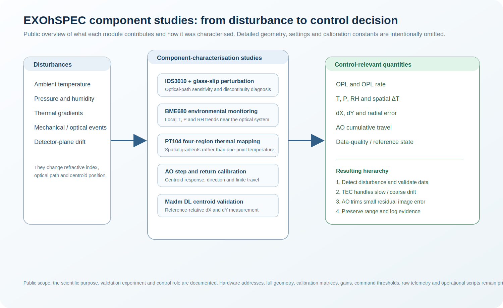

# Component studies and public-safe operating notes

This section records **why each major module was used**, the experiment that established its role, the minimum equations needed to understand the measurement, and how the result enters the feedback architecture.

It is deliberately an overview rather than a laboratory build manual. The repository does **not** publish exact optical geometry, electrical wiring, device addresses, COM ports, calibration matrices, PID gains, trigger thresholds, camera coordinates, raw telemetry, full automation code or operational safety configuration.

| Component or study | What the report covers | Characterisation question |
|---|---|---|
| [Experimental characterisation programme](experimental_characterisation_program.md) | How the individual studies form one controlled-development sequence | Which experiment reduced which uncertainty before hybrid control? |
| [IDS3010 interferometer and glass-slip perturbation](interferometer_and_glass_slip.md) | Optical-path monitoring, interference sensitivity and discontinuity diagnosis | Does a controlled optical-path perturbation produce a measurable and recoverable response? |
| [BME680 environmental monitoring](bme680_environmental_monitoring.md) | Local temperature, pressure and humidity context | Which environmental trends co-vary with OPL and centroid drift? |
| [PT104 four-region thermal mapping](pt104_four_region_thermal_mapping.md) | Spatial temperature gradients and thermal health | Is one temperature sensor representative of the whole enclosure? |
| [TEC thermal actuation](tec_thermal_control.md) | Slow thermal correction and step-response evaluation | How quickly and how smoothly can thermal drift be corrected? |
| [Active-optics calibration](active_optics_calibration.md) | Directional centroid response, return behaviour and travel limits | What fine correction can AO provide before range becomes limiting? |
| [MaxIm DL centroid tracking](maxim_dl_centroid_tracking.md) | Reference-relative image measurement and validation workflow | How are `dX` and `dY` measured consistently from the spectrum image? |
| [Python acquisition and analysis workflow](python_data_workflow.md) | Time alignment, quality flags and public-safe pseudocode | How are measurements converted into an auditable control record? |

## How to read these reports

Each component report follows the same structure:

1. **Role in EXOhSPEC** - what the component measures or actuates.
2. **Characterisation experiment** - what was deliberately perturbed or compared.
3. **Physics or control relation** - the compact equation used to interpret the measurement.
4. **Control implication** - how the result changes the feedback design.
5. **Public boundary** - which operational details remain private.

The reports support the broader conclusion that EXOhSPEC is a disturbance-rejection problem: environmental changes alter optical path and image position, a slow thermal actuator handles coarse drift, and a finite-range AO actuator performs fine correction.