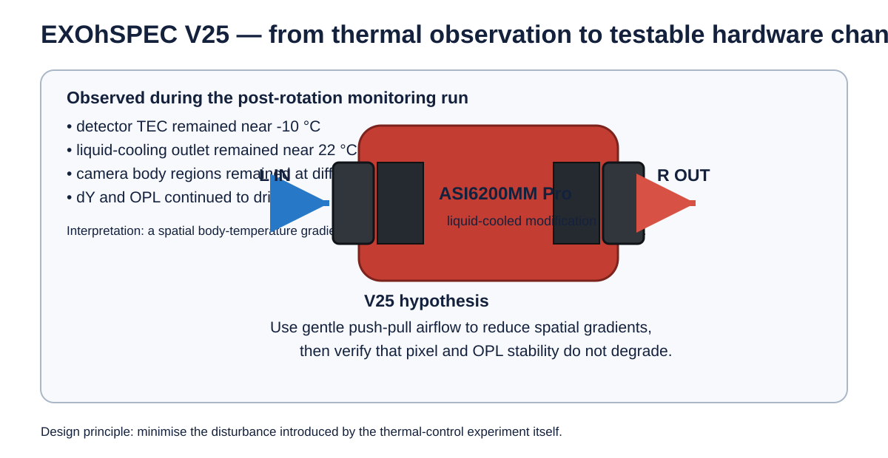
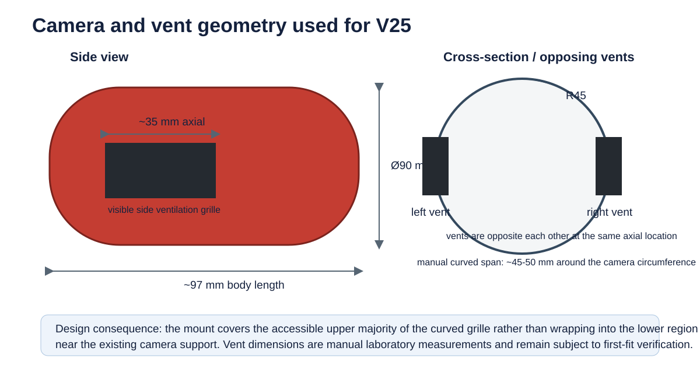
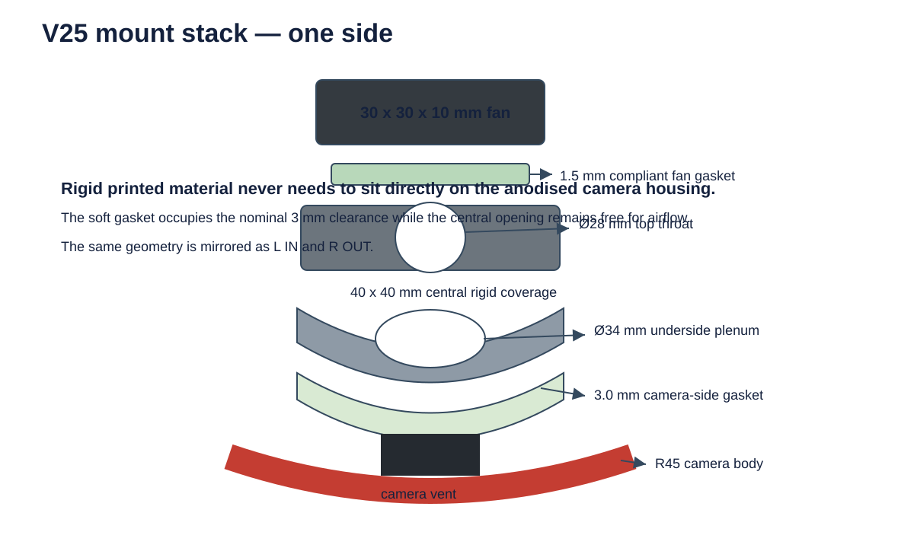
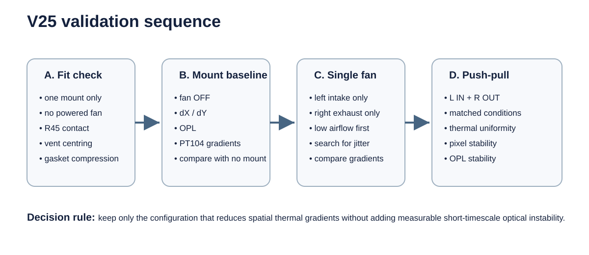

# EXOhSPEC V25 — camera thermal-homogenisation and dual side-vent fan-mount design

**Author:** Biswajit Jana  
**Project:** EXOhSPEC Stage-2 instrumentation development  
**Date:** 22 September 2026  
**Status:** design study and first-print prototype; not yet hardware-validated

  

## 1. Why I started this design

The immediate motivation came from the camera-rotation thermal experiment carried out after the ASI6200MM Pro was rotated by 180 degrees. The camera detector TEC remained near its existing -10 degrees C operating point, the external liquid-cooling loop remained close to its controlled temperature, and the coolant flow was stable. However, the camera body did not behave as a single isothermal object.

During the early part of the run, the externally measured camera regions remained at different absolute temperatures even while each individual probe changed only slowly. In the same interval, the phase-correlation measurement showed a clear detector-plane drift in dY, while the interferometer recorded a simultaneous OPL change. For example, during approximately the first 28 minutes the measured dY reached about +0.64 px and the OPL change reached about -0.32 micrometres, while the LK220 outlet remained close to 22 degrees C and the detector remained close to -10 degrees C.

This does **not** prove that the camera-body temperature gradient caused the optical drift. The camera had also been mechanically reoriented, and the experiment included environmental and structural effects that were not independently controlled. The result instead motivated a new question:

> Can a small amount of low-vibration forced airflow reduce the spatial temperature gradient around the camera body without degrading pixel or OPL stability?

The V25 design is intended to test that question experimentally.

## 2. Mechanical starting point

The stock ZWO ASI6200MM/MC Pro mechanical drawing gives a main camera body diameter of approximately 90 mm and an overall body length of approximately 97 mm. The current EXOhSPEC camera has been modified from the original rear-fan arrangement to use liquid cooling, so the stock thermal path cannot be assumed to represent the present instrument.

The side ventilation grilles are on opposing sides of the cylindrical camera body. Manual measurements made on the laboratory unit gave an accessible grille width of approximately **35 mm in the camera-axis direction** and approximately **45-50 mm along the curved circumferential span**. The lower part of the curved grille approaches the existing camera support, which limits access and makes a full wrap-around mount undesirable.

  

The design therefore uses two compact mounts positioned over the two opposing side vents at the same axial location:

- **left side:** intake;
- **right side:** exhaust;
- no additional rear fan;
- no drilling into the camera body;
- no permanent adhesive;
- no board-mounted support structure;
- no rigid plastic-to-aluminium contact.

## 3. Design requirements

| Requirement | Design response |
|---|---|
| Do not modify the camera body | no drilled or tapped holes in the camera |
| Preserve the ventilation opening | open central airflow throat and larger underside plenum |
| Avoid hard contact with the red camera housing | 3 mm compliant camera-side gasket |
| Reduce fan vibration coupling | 1.5 mm fan-side gasket / silicone isolation |
| Fit the measured grille | 40 mm central mount coverage over a ~35 mm axial vent |
| Avoid inaccessible lower curvature | 40 mm chord span rather than wrapping the full 45-50 mm grille |
| Keep fan power small | 30 x 30 x 10 mm, 5 V fan class |
| Keep the design reversible | modular left-intake and right-exhaust parts |
| Keep the design editable | parametric OpenSCAD source and modular geometry |
| Allow airflow rather than blocking the fan | 28 mm top throat expanding to a 34 mm underside plenum |

## 4. Final prototype geometry

The present prototype is intentionally conservative. It is designed for a **30 x 30 x 10 mm** fan and an approximately **R45** camera body.

  

| Parameter | Current value |
|---|---:|
| Camera diameter | 90 mm |
| Camera radius used by CAD | 45 mm |
| Manually measured vent width, axial | ~35 mm |
| Manually measured curved vent span | ~45-50 mm |
| Central rigid mount coverage | 40 x 40 mm |
| Fan envelope | 30 x 30 x 10 mm |
| Fan mounting-hole pitch | 24 mm |
| Fan-hole diameter | 3.4 mm |
| Top airflow throat | 28 mm diameter |
| Underside plenum | 34 mm diameter |
| Rigid camera-side clearance | 3.0 mm |
| Camera-side soft gasket | 3.0 mm |
| Fan-side gasket | 1.5 mm |

The **3 mm camera-side clearance** is deliberate. The rigid printed part is not intended to rest directly on the anodised camera body. A compliant TPU, silicone, or closed-cell silicone-foam gasket occupies this region. The gasket should support and seal the mount around the accessible perimeter while leaving the central plenum open over the ventilation grille.

The fan is separated from the rigid platform by a **1.5 mm compliant gasket**. This is intended to reduce direct motor-vibration transmission and also reduce air leakage around the fan frame.

### Airflow path

For the intake side:

room air → fan → 28 mm throat → 34 mm plenum → camera side vent.

The exhaust side uses the same geometry with the fan direction reversed. The purpose of using two identical mounts is to create a repeatable push-pull path while keeping the mechanical geometry symmetric.

## 5. Fan selection

The first prototype is designed around the 30 mm Sunon MagLev/Vapo family because the form factor fits the measured grille and the 5 V variants can be powered independently from a simple regulated USB or bench supply.

| Model | Supply | Current | Power | Speed | Airflow | Static pressure | Noise | Bearing |
|---|---:|---:|---:|---:|---:|---:|---:|---|
| Sunon MF30100V3-1000U-A99 | 5 V | 45 mA nominal manufacturer value | 0.23 W | 6000 rpm | 2.5 CFM | 0.07 in H2O | 10.2 dBA | Vapo / MagLev |
| Sunon MF30100V2-1000U-A99 | 5 V | 80 mA | 0.40 W | 9500 rpm | 4.7 CFM | 0.17 in H2O | 21 dBA | Vapo / MagLev |
| Sunon MF30100V1-1000U-A99 | 5 V | 120 mA | 0.60 W | 11000 rpm | 5.5 CFM | 0.20 in H2O | 23 dBA | Vapo / MagLev |

The **V3** is the preferred starting point because this experiment is not trying to maximise airflow. The objective is to find the minimum forced airflow that improves thermal uniformity without introducing measurable detector or OPL jitter. Two V3 fans would dissipate only a few tenths of a watt each, but their motor power is still a real heat and vibration source and must be tested rather than assumed negligible.

As a September 2026 supplier snapshot, Rapid Electronics listed the MF30100V3-1000U-A99 at **£11.72 ex VAT** for one unit, while DigiKey UK listed the higher-flow MF30100V2-1000U-A99 at **£8.42 ex VAT** for one unit. Supplier pricing is included only as a procurement snapshot and will change over time.

## 6. Why the mount is modular

Several early CAD iterations were deliberately rejected.

The first saddle-style concept followed too much of the full 90 mm camera curvature and produced a bulky part. A later flat bridge improved access but did not provide a sufficiently explicit airflow opening. PrusaSlicer testing then showed that a monolithic STL was inconvenient for engineering iteration because individual bosses, tabs, labels and gaskets could not be edited independently.

The current design therefore separates the geometry into:

1. curved camera-side base;
2. fan platform;
3. four fan bosses;
4. four local preload/contact tabs;
5. 3 mm camera-side compliant gasket;
6. 1.5 mm fan-side gasket;
7. recessed direction label: **L IN** or **R OUT**;
8. recessed author mark: **B. JANA**.

The public CAD source is parametric so dimensions can be altered after the first physical fit test without redrawing the whole mount.

## 7. Experimental plan

  

### Stage A — mechanical fit

Print one rigid mount first, with no powered fan. Check the R45 contact geometry, vent centring, 3 mm gasket space, support clearance and cable clearance.

### Stage B — vibration baseline

With the mount installed but the fan OFF, repeat the normal detector/OPL monitoring sequence. This separates any effect of the mount preload from fan rotation.

### Stage C — single-fan tests

Test left-intake only and right-exhaust only. A single fan may be preferable if it removes enough heat while adding less vibration than the two-fan configuration.

### Stage D — push-pull test

Operate left intake and right exhaust together. Record PT104 gradients, CMOS temperature and cooler power, liquid-cooling telemetry, phase-correlation dX/dY, centroid position and interferometric OPL.

The comparison should use matched windows and the same detector, liquid-cooling and optical-control conditions. The success criterion is not simply a lower camera temperature. The useful configuration is the one that reduces the **spatial temperature gradient** while preserving or improving detector and OPL stability.

## 8. Risks and failure modes

**Fan-induced vibration.** Motor imbalance, bearing excitation, mounting resonance or beat frequencies between two fans could appear directly in dX, dY or OPL.

**Air recirculation.** Without a reasonably sealed local plenum, an intake fan can move air around the outside of the camera instead of through the intended ventilation path.

**Electrical coupling.** The fans should initially use an independent 5 V supply rather than the camera power rail.

**Over-constraining the camera.** The mount must not act as a structural clamp on the detector housing. The soft gasket should locate and seal the airflow path with only the preload required to prevent motion.

**Dust and contamination.** Forced airflow can increase particle transport, so testing should begin at low airflow in the normal enclosed laboratory configuration.

## 9. Current status

V25 is presently a **design and prototype stage**, not a demonstrated performance upgrade.

Completed:

- measured the accessible side-vent geometry;
- defined a two-sided intake/exhaust architecture;
- shortlisted compact low-power fan options;
- developed the parametric 40 mm mount geometry;
- added a 28 mm airflow throat and 34 mm plenum;
- added compliant camera-side and fan-side gaskets;
- separated the model into modular editable parts;
- prepared left-intake and right-exhaust variants.

Next:

- print one mount;
- check real fit on the modified ASI6200;
- revise dimensions if necessary;
- perform mount-only and fan-on vibration checks;
- run matched thermal + pixel + OPL experiments.

The design should only be considered successful if the experimental data show that improved thermal uniformity outweighs any vibration, electrical or airflow disturbance introduced by the fans.

## 10. CAD files

The editable source and design dimensions are stored in:

- [EXOhSPEC_V25_mount_v0_6_parametric.scad](../../designs/v25_camera_fan_mount/EXOhSPEC_V25_mount_v0_6_parametric.scad)
- [DIMENSIONS.json](../../designs/v25_camera_fan_mount/DIMENSIONS.json)
- [design README](../../designs/v25_camera_fan_mount/README.md)

## References

1. ZWO, **ASI6200 Pro Series** — https://www.zwoastro.com/product/asi6200/
2. ZWO, **ASI6200MM/MC Pro manual and mechanical drawing** — https://i.zwoastro.com/zwo-website/manuals/ASI6200_Manual_EN_v1.4.pdf
3. Sunon, **30 x 30 x 10 mm DC brushless fan series** — https://www.sunon.com/eu/MANAGE/Docs/WEBCONT/Files/1236/Sunon%20DC%20Brushless%20Fan%20%26%20Blower_%28240-E%29.pdf
4. Rapid Electronics, **MF30100V3-1000U-A99** — https://www.rapidonline.com/sunon-mf30100v3-1000u-a99-axial-fan-5v-dc-4-25m-h-30x30x10mm-07-2383
5. DigiKey UK, **MF30100V2-1000U-A99** — https://www.digikey.co.uk/en/products/detail/sunon-fans/MF30100V2-1000U-A99/10441404

---

**Design and experimental development:** Biswajit Jana, 2026.  
This report records an ongoing EXOhSPEC instrumentation study. It should be read as a design rationale and test plan, not as a final causal claim or validated thermal-performance result.
