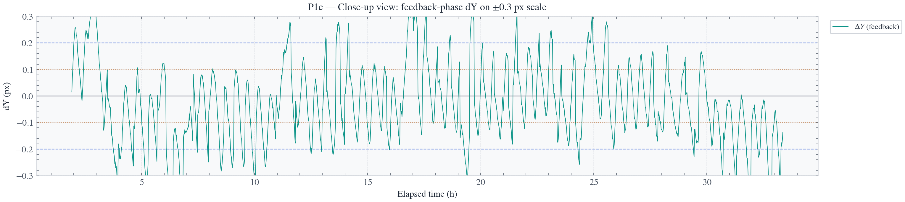
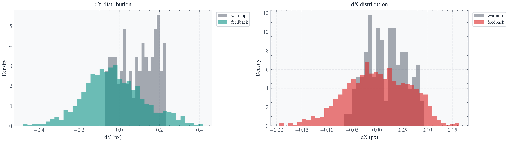
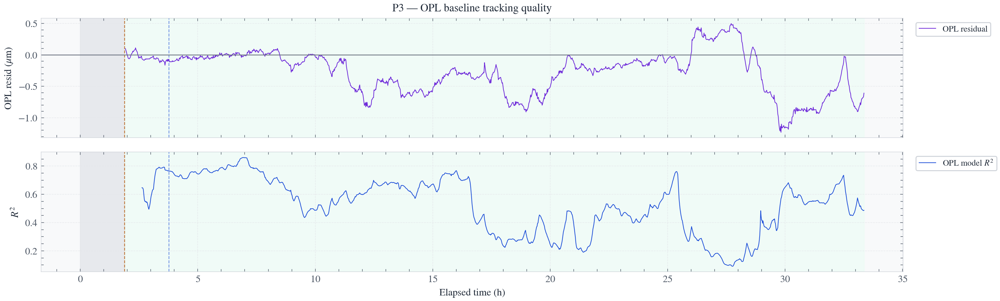
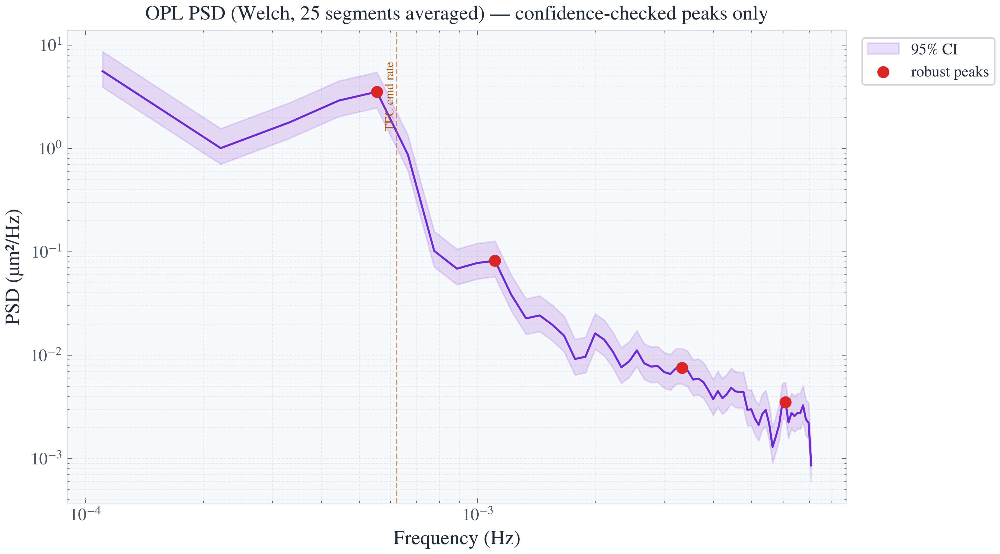
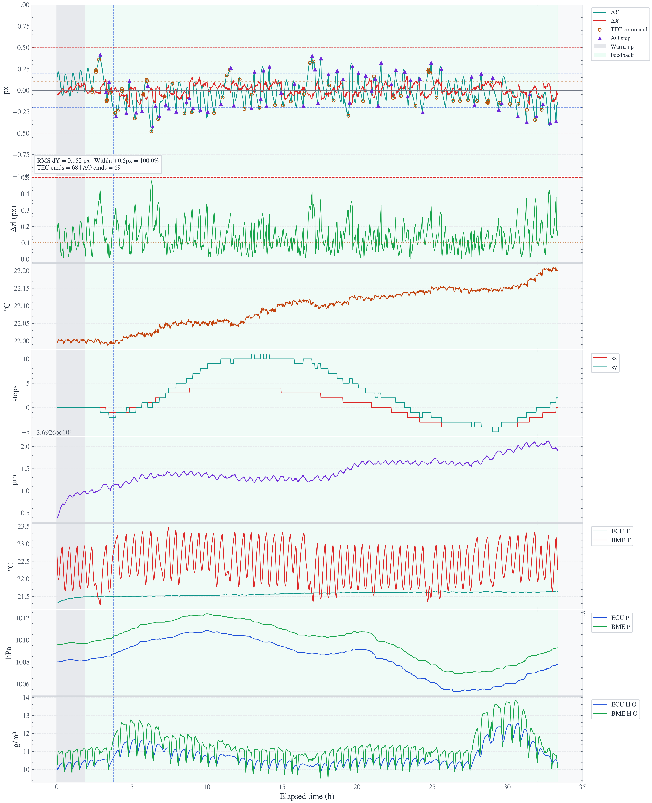

# EXOhSPEC V11 — 33-Hour Closed-Loop Run Report

**Author:** Biswajit Jana  
**Supervisors:** Prof. Hugh Jones, Prof. Bill Martin  
**Run date:** 1–2 July 2026  
**Run duration:** 33.36 h  
**Data files:** `rt_stage2_v11.csv`, `exohspec_v11_final.py`

---

## 1. Summary

This report documents a 33.36-hour EXOhSPEC V11 closed-loop stabilisation run using TEC thermal correction and active-optics fine correction.

**Primary result:** across 31.44 h of feedback, V11 maintained all controller-coordinate feedback frames within ±0.5 px. The controller-coordinate radial RMS was 0.1634 px, with ΔX RMS = 0.0635 px and ΔY RMS = 0.1524 px.

The residual error was therefore dominated by the vertical direction, ΔY. Horizontal motion remained substantially smaller throughout the run.

> [!NOTE]
> The 100% containment result is relative to the adaptive controller reference. Relative to the initial fixed feedback reference, V11 achieved radial RMS = 0.225 px and 98.63% containment within ±0.5 px. Both metrics are reported because they answer different questions: closed-loop operating containment versus conservative physical drift.

---

## 2. Run overview

| Metric | Value |
|---|---:|
| Total logged duration | 33.36 h |
| Warm-up duration | 1.88 h, 96 frames |
| Feedback duration | 31.44 h, 1604 frames |
| Feedback ΔX RMS | 0.0635 px |
| Feedback ΔY RMS | 0.1524 px |
| Feedback radial RMS | 0.1634 px |
| Maximum \|ΔY\| | 0.4794 px |
| Controller-coordinate frames within ±0.5 px | 100.0% |
| Controller-coordinate frames within ±0.2 px | 81.0% |
| Fixed-reference frames within ±0.5 px | 98.63% |
| OPL residual RMS | 0.4341 µm |
| Median OPL model R² | 0.546 |
| TEC commands | 68 |
| AO commands | 69 |
| Maximum cumulative AO \|sx\| | 4 steps |
| Maximum cumulative AO \|sy\| | 11 steps |
| Rejected centroid frames | 0 |
| AO unload events | 0 |

---

## 3. Axis-resolved closed-loop performance

ΔY was the principal stability direction because it carried the larger residual motion and was the direction in which V8.3 later lost containment. V11 nevertheless remained stable in both axes:

- **ΔX RMS = 0.0635 px**
- **ΔY RMS = 0.1524 px**
- **Radial RMS = 0.1634 px**

Thus, ΔX was approximately 2.4 times quieter than ΔY. The remaining performance limit was vertical residual motion rather than horizontal drift.

The distribution comparison shows that the feedback residuals remain concentrated around zero, with ΔX narrower than ΔY.

---

## 4. OPL model and spectral context

The OPL residual remained bounded but was not perfectly removed by the environmental model:

| OPL metric | Value |
|---|---:|
| Residual RMS | 0.4341 µm |
| Largest absolute residual | 1.233 µm |
| Fraction within ±0.5 µm | 73.4% |
| Median rolling model R² | 0.546 |

The centroid remained well controlled despite these residual OPL excursions. This indicates that the present controller has sufficient practical containment authority, while the OPL/environmental model remains the main area for further refinement.

The spectral analysis identifies periodic structure consistent with the control-loop timescales. These associations are informative but should not be interpreted as proof of causality without a separate open-loop or no-command comparison run.

| Candidate period | Frequency | Interpretation |
|---|---:|---|
| ~30 min | 5.54×10⁻⁴ Hz | Consistent with TEC-command rhythm |
| ~15 min | 1.11×10⁻³ Hz | Approximate harmonic |
| ~5 min | 3.32×10⁻³ Hz | Faster correction-scale structure |
| ~2.7 min | 6.09×10⁻³ Hz | Near-Nyquist residual structure |

---

## 5. Full-run diagnostic

The stacked diagnostic provides the full temporal context: centroid residuals, radial error, TEC evolution, AO cumulative travel, OPL, and environmental telemetry.

The AO system remained within its travel envelope throughout the run. The y-axis ledger reached 11 steps but recovered without hitting the unload trigger at 14 steps.

---
## 6. Comparison across key control runs

To avoid blank cells and ensure a fair comparison, this table uses **radial error**, which is available for every run. Axis-resolved ΔX and ΔY values are stated separately for V11.

| Run | Control approach | Comparison duration | Radial RMS | Within ±0.5 px | Long-duration outcome |
|---|---|---:|---:|---:|---|
| A — 23 Mar | Hybrid TEC + AO | 43.47 h | 0.8379 px | 51.56% | **Limited containment** |
| C — 15 Apr | Fixed-model hybrid | 47.11 h | 4.9907 px | 23.32% | **Fixed-model failure** |
| D — 20 Apr | Fixed-prior / fixed-model | 35.19 h | 5.8920 px | 28.95% | **Late-run breakaway** |
| E — 22–24 Apr | Attended TEC-primary + AO | 45.24 h | 1.3113 px | 47.82% | **Partial recovery, but large excursions remained** |
| V8.3 — early MIMO | MIMO feedback, first ≤6 h | 5.47 h | 0.225 px | 99.6% | **Strong bounded short interval** |
| V8.3 — full MIMO | MIMO feedback, complete run | 10.64 h | 1.016 px | 58.4% | **Late model mismatch and containment loss** |
| V11 — fixed initial reference | Adaptive warm-up model + TEC + AO | 31.44 h feedback | 0.225 px | 98.63% | **Conservative long-duration drift result** |
| V11 — adaptive controller reference | Adaptive warm-up model + TEC + AO | 31.44 h feedback | 0.1634 px | 100.0% | **Sustained closed-loop containment** |

### V11 axis-resolved result

| Metric | Value | Interpretation |
|---|---:|---|
| ΔX RMS | 0.0635 px | Horizontal residual remained small throughout the feedback run |
| ΔY RMS | 0.1524 px | Vertical residual was the dominant remaining error direction |
| Radial RMS | 0.1634 px | Combined controller-coordinate image error |
| Fixed-reference radial RMS | 0.225 px | Conservative assessment against the initial feedback reference |
| Fixed-reference containment | 98.63% within ±0.5 px | Long-duration physical-drift-relative result |

V11 therefore matches V8.3's best early-MIMO radial RMS of 0.225 px when assessed against its initial fixed reference, but maintains that result for **31.44 h rather than 5.47 h**. Relative to the adaptive controller reference, V11 improves further to 0.1634 px radial RMS with 100% containment inside ±0.5 px.

The remaining V11 error budget is dominated by ΔY. Its ΔX RMS is approximately 2.4 times smaller than ΔY RMS, showing that horizontal control was consistently quieter while vertical residual motion remains the primary refinement target.

> **Caveat:** V11 is strong evidence from one 31.44-hour feedback run. A second independent long-duration repeat is required before claiming repeatability.
---

## 7. Reproducibility

- Source CSV: `rt_stage2_v11.csv`
- Controller source: `exohspec_v11_final.py`
- Analysis notebook: `EXOhSPEC_V11_analysis.ipynb`
- Controller basis: V6 preserved with V11 AO quiet-time relaxation and CCD cooler-settling gate.
- Figures: `results/figures/`
