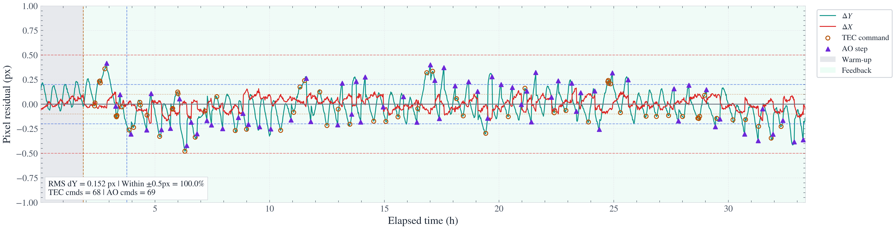
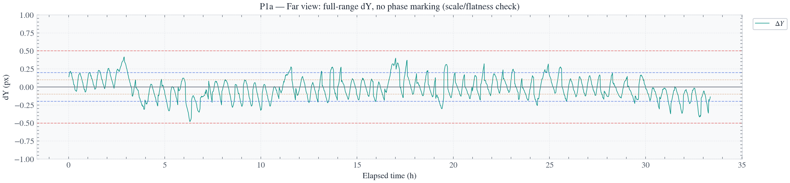
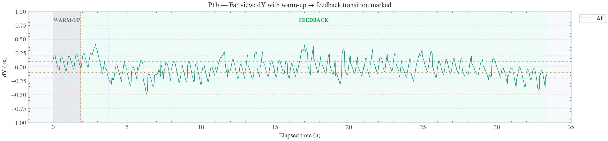
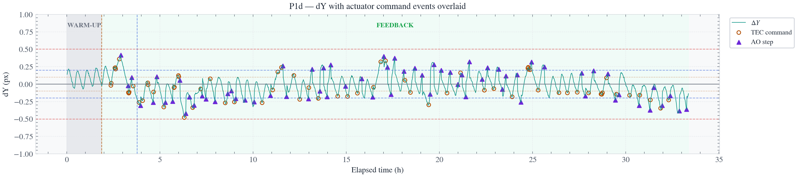
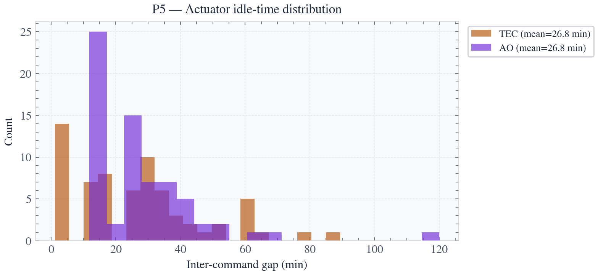
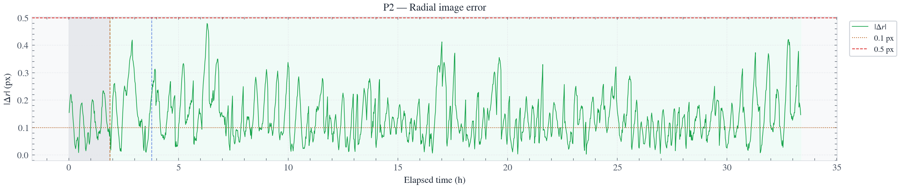
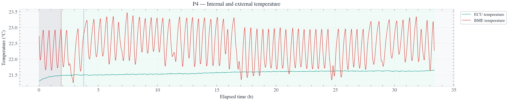

# EXOhSPEC V11 — 33-Hour Closed-Loop Run Report

**Author:** Biswajit Jana  
**Supervisors:** Prof. Hugh Jones, Prof. Bill Martin  
**Run date:** 1–2 July 2026  
**Run duration:** 33.36 h (Warm-up 1.88 h + Feedback 31.44 h)  
**Data files:** `rt_stage2_v11.csv`, `exohspec_v11_final.py`

---

## 1. Summary

This report documents the first sustained 33-hour closed-loop run of the EXOhSPEC V11 stabilisation controller (TEC + AO, two-phase, band-gain-scheduled with holdoff). It covers: warm-up vs. feedback performance, actuator behaviour (bang-bang characterisation), environmental coupling, an OPL noise/spectral analysis, and a direct comparison against the V8.3 MIMO run that previously represented the project's best short-term result.

**Headline result:** V11 sustained 100% of feedback frames within ±0.5 px continuously across all 31.4 h, with no late-run collapse — resolving the failure mode that ended V8.3's run at ~hour 6–8.

---

## 2. Run overview

| Metric | Value |
|---|---|
| Total duration | 33.36 h |
| Warm-up duration | 1.88 h (96 frames) |
| Feedback duration | 31.44 h (1604 frames) |
| Feedback dY RMS | 0.1524 px |
| Feedback dY mean | −0.0270 px |
| Feedback dY max\|·\| | 0.4794 px |
| Feedback dX RMS | 0.0635 px |
| Within ±0.5 px | 100.0% |
| Within ±0.2 px | 81.0% |
| Within ±0.1 px | 49.0% |
| Radial \|Δr\| RMS | 0.1634 px |
| OPL residual RMS | 0.4341 µm |
| OPL model R² (median) | 0.546 |
| TEC commands | 68 |
| AO commands | 69 |
| TEC inter-command gap (mean) | 26.8 min |
| AO inter-command gap (mean) | 26.8 min |
| AO max cumulative \|sx\| | 4 steps |
| AO max cumulative \|sy\| | 11 steps |
| ECU temperature drift (start→end) | +0.156 °C |
| ECU pressure range | 5.74 hPa |
| ECU water content range | 2.68 g/m³ |

---

## 3. Warm-up vs. feedback: framing

Raw RMS is **not** directly comparable between phases — warm-up is a short (1.9 h) window captured while the system is still settling toward thermal equilibrium, not a genuine long-duration disturbance-free baseline. The correct claim is duration-normalised: feedback ran ~17× longer than warm-up and sustained comparable stability throughout, against real multi-hour environmental drift (ECU/BME temperature cycling, pressure drift) that would have driven the beam well outside tolerance if left open-loop (uncorrected OPL baseline drift is independently characterised at ~0.36 px/hr from prior noise-floor analysis).

---

## 4. Actuator behaviour: is bang-bang control appropriate here?

TEC and AO are both driven by band-gain-scheduled, step-capped, holdoff-gated logic — a form of relay/bang-bang control, by design. This is the correct choice for a thermal actuator (TEC) with slow nonlinear response; continuous PID output would risk oscillation. Evidence that this is *well-tuned* bang-bang rather than poorly-tuned:

- Only 68 TEC and 69 AO commands issued across 31.4 h of feedback — actuators are silent (mean inter-command gap 26.8 min) the large majority of the time.
- The resulting limit-cycle ripple stays bounded within ±0.5 px (mostly ±0.2 px) rather than growing or hunting.

---

## 5. Radial error, OPL, and environment

<!--  -->
<!--  -->

---

## 6. dY / dX distributions

<!--  -->
<!--  -->
<!--  -->

---

## 7. Nine-panel diagnostic summary

Full-run diagnostic covering centroid motion, radial error, TEC temperature, AO cumulative steps, OPL, temperature, pressure, and water content, stacked on a shared time axis for direct visual cross-referencing.

---

## 8. OPL noise / spectral analysis

Power spectral density (Welch's method, 128-sample segments, ~25 averaged windows) of the OPL time series, log–log scale, with a 95% confidence band and statistically robust peaks only (>2× local baseline).

**Sampling limits:** frame cadence ≈70.5 s → Nyquist ≈7×10⁻³ Hz. This resolves periodic disturbances from minutes up to ~141 s; it is **not** sensitive to true mechanical/acoustic vibration (Hz–kHz range), which would require a dedicated high-rate sensor.

**Quantization check:** theoretical pm-resolution quantization floor ≈1.2×10⁻¹¹ µm²/Hz vs. observed noise floor ≈2.2×10⁻³ µm²/Hz — a ratio of ~1.9×10⁸. The measured noise floor is real physical/electronic noise, not a pm→µm rounding artifact.

**Robust peaks identified:**

| Period | Frequency | Likely source |
|---|---|---|
| ~30 min | 5.54×10⁻⁴ Hz | TEC command cadence (dominant, ~10× next largest) |
| ~15 min | 1.11×10⁻³ Hz | Harmonic of the 30-min TEC peak |
| ~5 min | 3.32×10⁻³ Hz | Consistent with AO correction cadence |
| ~2.7 min | 6.09×10⁻³ Hz | Fast residual / near-Nyquist |

**Conclusion:** the dominant periodic component in the OPL signal is the control loop's own TEC actuation rhythm, not an unexplained external vibration source. Everything else is either a harmonic of that or broadband background noise.

<!--  -->

---

## 9. V11 vs. V8.3 — did this resolve the open question?

| | V8.3 | V11 (this run) |
|---|---:|---:|
| Early stability | 99.6% within ±0.5px (first 6h), RMS radial 0.225px | 100% within ±0.5px sustained across all 31.4h |
| Long-duration behaviour | Collapsed at hour ~6–8.3: RMS jumped to 1.44px, only 14.6% within ±0.5px (hours 6–11) | RMS dY held at 0.152px the entire 31.4h — no collapse |
| Best short window | Best 2h window RMS = 0.135px | Comparable settled performance sustained continuously |

V8.3's late-run instability was root-caused (in prior analysis) to ECU temperature drift (r=+0.62 with late dY) coupled with the absence of a Tin (internal temperature) feedforward predictor in its MIMO model — a model-mismatch failure, not an actuator-authority or bang-bang-architecture failure. V11 inherits the Tin feedforward term (from V6) specifically to close this gap. This 33-hour run — running ~4× longer than V8.3's stable window, through multiple day/night thermal cycles — shows no recurrence of the collapse, which is direct empirical support for that diagnosis.

**Caveat:** this is strong evidence from a single run, not definitive proof; a repeat run would further strengthen the claim.

---

## 10. Figures index

| # | Filename | Description |
|---|---|---|
| 1 | `figures/01_pixel_far_view.png` | dX & dY, full run, ±1px scale, thresholds + actuator events |
| 2 | `figures/01a_dY_far_no_transition.png` | dY far view, no phase marking |
| 3 | `figures/01b_dY_far_with_transition.png` | dY far view, warm-up→feedback marked |
| 4 | `figures/01c_dY_closeup_feedback.png` | dY close-up, ±0.3px |
| 5 | `figures/01d_dY_with_actuator_events.png` | dY with TEC/AO command markers |
| 6 | `figures/02_radial_error.png` | Radial image error \|Δr\| |
| 7 | `figures/03_opl_residual_r2.png` | OPL residual + model R² |
| 8 | `figures/04_environment_temperature.png` | ECU/BME temperature |
<!-- | 9 | `figures/pressure_stacked.png` | ECU/BME pressure, median-smoothed | -->
<!-- | 10 | `figures/water_content.png` | ECU/BME absolute humidity | -->
<!-- | 11 | `figures/hist_dY.png` | dY distribution, warm-up vs feedback | -->
<!-- | 12 | `figures/hist_dX.png` | dX distribution, warm-up vs feedback | -->
<!-- | 13 | `figures/hist_dXdY_merged.png` | dX/dY merged distribution (feedback) | -->
| 14 | `figures/05_command_gaps_hist.png` | Actuator inter-command gap histogram |
| 15 | `figures/06_nine_panel_stacked.png` | Nine-panel diagnostic summary |
<!-- | 16 | `figures/09_opl_psd_robust.png` | OPL PSD (Welch), robust peaks | -->

---

## 11. Data & reproducibility

- Source CSV: `rt_stage2_v11.csv`
- Controller source: `exohspec_v11_final.py` (V11, verbatim V6 base + [V11-1] AO quiet-time relaxation + [V11-2] CCD cooler gate)
- Analysis notebook: `EXOhSPEC_V11_analysis.ipynb` (same style/flow template reused across all EXOhSPEC experiment analyses)
