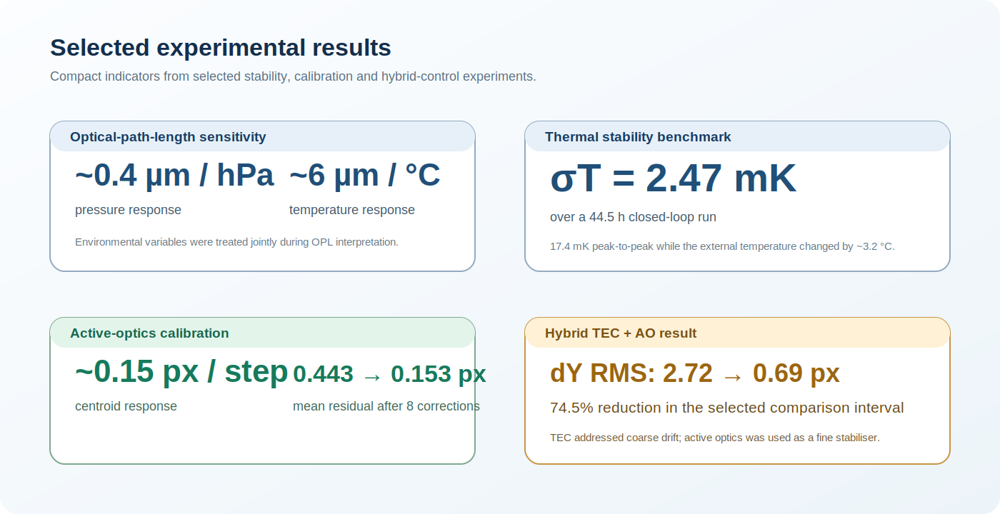

# Selected experimental results

This folder contains compact result records with their comparison windows and interpretation stated explicitly. It is not a raw-data release.

## Experiment records

| Record | What it contributes |
|---|---|
| [Exp-H long-run OPL + pixel benchmark](exp_h_long_run_benchmark.md) | Temperature-only feedback under a strong pressure disturbance; establishes the residual limit that motivated a fine correction layer. |
| [March hybrid TEC-AO recovery experiment](march_hybrid_recovery.md) | 44.36-hour disturbed run; documents sub-pixel final recovery together with the full-run limitation. |
| [Why perfect zero-pixel regulation was not yet achieved](why_zero_pixel_regulation_not_yet_achieved.md) | Control-report explanation of why the system differs from a textbook step-response problem, supported by Stage-2 metrics and a limitations map. |
| [June 2026 local thermal-impulse repeat campaign](thermal_impulse_repeat_campaign_2026-06-22_to_24.md) | Four-location component-sensitivity study comparing grating and camera-mount thermal impulses with OPL, centroid and environmental context. |

## Cross-experiment indicators

| Area | Reported result | Interpretation |
|---|---:|---|
| Environmental optical-path response | approximately 0.4 micrometres per hPa; approximately 6 micrometres per degree C | Pressure and temperature both produced measurable optical-path-length variation. |
| Thermal control | standard deviation of temperature, sigma T = 2.47 mK over 44.5 h; 17.4 mK peak-to-peak | The TEC maintained millikelvin-level stability during a long closed-loop run despite an external temperature change of approximately 3.2 degrees C. |
| Active-optics calibration | approximately 0.15 px per step | The active-optics unit had sufficient authority for small centroid corrections, but its finite travel requires range management. |
| Fine correction test | mean residual 0.443 px to 0.153 px across 8 automated corrections | AO reduced small residual centroid offsets after calibration. |
| Hybrid control comparison | dY RMS 2.72 px to 0.69 px | The selected comparison interval showed a 74.5% reduction when thermal control was combined with AO fine trim. |
| Local thermal-impulse repeat | Grating A: strongest centroid response; Camera mount A: strongest OPL response | Establishes repeat priorities, not a final root-cause assignment. |

Raw telemetry, laboratory configuration and detailed controller versions are not published here. The public record provides the measured scale of the problem, the control architecture and a hardware-independent decision model.