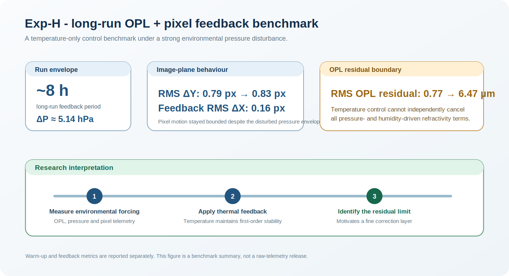

# Exp-H: Long-run OPL + pixel feedback benchmark

## Aim

Exp-H tested the limit of temperature-only feedback over a multi-hour interval with optical path length (OPL), environmental and detector-plane measurements evaluated together. The purpose was to determine whether thermal correction could keep the image motion bounded under a strong refractive-index disturbance envelope, and to identify the residual that a second correction layer would need to address.

## Selected comparison

| Quantity | Warm-up | Feedback | Reading |
|---|---:|---:|---|
| RMS `dY` | 0.79 px | 0.83 px | Detector-plane motion remained comparable to the warm-up scale over the selected long-run comparison. |
| RMS `dX` | - | 0.16 px | Cross-axis motion stayed smaller than the dominant `dY` response. |
| RMS OPL residual | 0.77 µm | 6.47 µm | OPL residual increased under the environmental disturbance, despite bounded pixel motion. |
| Pressure span | - | ~5.14 hPa | Strong pressure forcing for a temperature-only control experiment. |
| Approximate duration | - | ~8 h | Long-run stress-test window. |
| Feedback updates | - | 19 | Event-based thermal corrections during the selected run. |

## Interpretation

The main result is not that temperature control removed all optical-path variation. It did not: the OPL residual remained sensitive to pressure- and humidity-driven refractivity changes. Rather, Exp-H showed that the temperature loop could maintain first-order image-plane stability under a disturbance envelope far larger than that of the earlier short, quiet tests.

This makes Exp-H a useful **temperature-only benchmark**. It also defines the reason for the later hierarchy: TEC control handles the slow, coarse component of drift, while a separate fine actuator is needed for residual image motion that cannot be efficiently absorbed by thermal correction alone.

## Reporting note

The values above describe the explicitly selected warm-up and feedback windows used in the benchmark analysis. They should not be read as a release of raw telemetry or as a claim that every section of the full run had identical stability.
