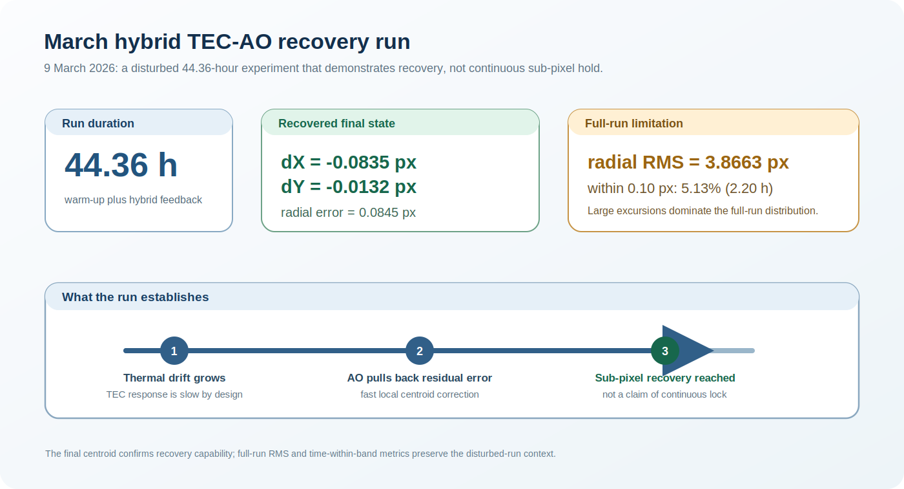

# March 2026 hybrid TEC-AO recovery experiment

## Aim

This 44.36-hour experiment tested a hybrid strategy in which the TEC addresses slow thermal drift and active optics (AO) provides a faster local correction when the centroid has moved away from the reference position.

The stability target was

\[
r = \sqrt{dX^2 + dY^2} \leq 0.10\ \mathrm{px}.
\]

## Full-run summary

| Quantity | Value | Reading |
|---|---:|---|
| Total duration | 44.36 h | Includes warm-up and hybrid feedback. |
| Final `dX` | -0.0835 px | Final recovered centroid component. |
| Final `dY` | -0.0132 px | Final recovered centroid component. |
| Final radial error | 0.0845 px | Final state was inside the 0.10 px target circle. |
| Full-run radial RMS | 3.8663 px | Large disturbed-run excursions dominated the global statistic. |
| Time within 0.10 px radial error | 2.20 h (5.13%) | Strict-band residence time over the full run. |
| Time within 0.20 px radial error | 3.49 h (8.1%) | Relaxed-band residence time over the full run. |

## What this experiment demonstrates

The March run is a **recovery demonstration**, not a continuous-lock benchmark. The full-run RMS was high because the experiment included substantial centroid excursions, particularly along `dY`. Nevertheless, the hybrid system brought the centroid back to a final radial error of 0.0845 px.

The technical lesson is the division of labour between the actuators:

- the TEC corrects slow environmental and thermal drift but has a delayed response;
- AO provides a rapid local pull-back when the residual image error is already in a manageable range;
- AO travel must remain bounded, so sustained offsets should be transferred back to the thermal loop.

This experiment motivated the later TEC-primary/AO-fine-trim design: AO should not be asked to rescue an unstable thermal state, but it can improve recovery once the coarse drift has been brought within range.

## Reporting note

The recovered final point is reported together with the full-run RMS and threshold residence times so that the result is not interpreted as uninterrupted 0.10 px stability.
