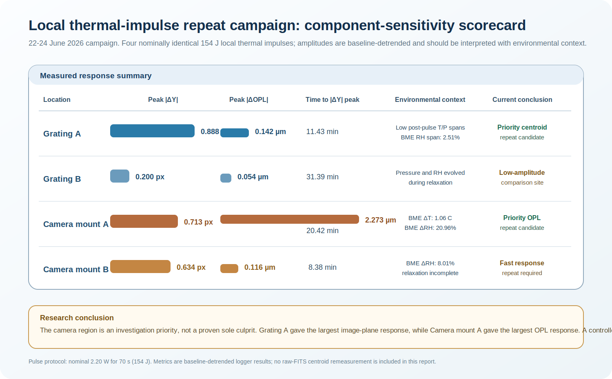

# Local thermal-impulse repeat campaign: 22-24 June 2026

> **Status:** preliminary component-sensitivity study.  
> **Trials acquired:** 22-23 June 2026.  
> **Analysis and repeat-campaign consolidation:** 24 June 2026.  
> **Purpose:** identify accessible regions whose local thermal perturbation produces a reproducible optical-path-length (OPL) or detector-centroid response before assigning component-specific coefficients to a stability model.

## Summary

This is a **four-location local-thermal impulse comparison**, not a claim of a final root cause.

- Every trial received the same nominal electrical pulse: **2.20 W for 70 s = 154 J**.
- The largest observed detector-plane jump occurred at **Grating A**: $|\Delta Y|_{\max}=0.888\ \mathrm{px}$.
- The largest observed OPL change occurred at **Camera mount A**: $|\Delta\mathrm{OPL}|_{\max}=2.273\ \mu\mathrm{m}$.
- Camera mount A is therefore a strong OPL-sensitivity candidate, but it was also the most environmentally disturbed trial.
- None of the four trials provides a valid settling-time measurement because no record demonstrated a complete return to the defined post-pulse stability band.

**Decision:** the next controlled repeats should prioritise **Grating A** for detector-centroid sensitivity and **Camera mount A** for OPL sensitivity. The present data do **not** prove that the camera is the unique or dominant instability source.

---

## 1. Experimental question

The experiment asked:

> When the same short thermal input is applied at different accessible regions, which location produces the largest and cleanest change in OPL and detector centroid?

The reference-relative centroid coordinates are

$$
\Delta X(t)=X(t)-X_{\mathrm{ref}},
\qquad
\Delta Y(t)=Y(t)-Y_{\mathrm{ref}},
$$

with radial detector-plane response

$$
r(t)=\sqrt{\Delta X(t)^2+\Delta Y(t)^2}.
$$

The interferometric quantity is the baseline-relative optical-path response:

$$
\Delta\mathrm{OPL}(t)=\mathrm{OPL}(t)-\mathrm{OPL}_{\mathrm{baseline}}(t).
$$

For centroid and OPL response amplitudes, a linear pre-pulse trend was removed before calculating peaks. This prevents a pre-existing drift from being counted as a thermal response.

---

## 2. Pulse protocol and what was actually supplied

Each trial used the same nominal electrical heating impulse:

$$
P=8.80\ \mathrm{V}\times0.25\ \mathrm{A}=2.20\ \mathrm{W},
$$

$$
E_{\mathrm{pulse}}=P\Delta t=(2.20\ \mathrm{W})(70\ \mathrm{s})=154\ \mathrm{J}.
$$

The sequence was:

1. nominal 15-minute baseline;
2. 70-second local heater pulse;
3. passive relaxation while centroid, OPL, TEC, ECU and BME channels continued to log.

### Important temperature interpretation

The experiment controlled **electrical energy**, not the surface temperature of the heated component. A local component-temperature rise was not measured directly. ECU and BME temperatures provide environmental context, while the camera-temperature channel is treated as a health/context diagnostic until its timing and calibration relative to the camera mount are independently verified.

| Location | Trial identifier | Date | Baseline samples | Relaxation samples | Usable duration (min) |
|---|---|---|---:|---:|---:|
| Grating A | `GRATING_A_R01_20260622_133547` | 22 June | 23 | 16 | 26.35 |
| Grating B | `GRATING_B_R01_20260622_144720` | 22 June | 23 | 47 | 46.30 |
| Camera mount A | `CAMERA_MOUNT_RIGHT_A_R01_20260623_123149` | 23 June | 23 | 47 | 46.26 |
| Camera mount B | `CAMERA_MOUNT_B_LEFT_R01_20260623_140332` | 23 June | 23 | 11 | 23.29 |

Only two science frames occurred within the 70-second pulse itself. These trials therefore constrain the **delayed thermal response**, not the sub-minute heating transient.

---

## 3. Baseline quality before heating

The baseline must be evaluated before interpreting a response. A large pre-pulse scatter or slope means that a later apparent response may contain both heating and pre-existing drift.

| Location | Baseline ΔY slope (px min⁻¹) | Baseline σΔY (px) | Baseline assessment |
|---|---:|---:|---|
| Grating A | -0.0499 | 0.1208 | Centroid baseline was already drifting/noisy; large response requires confirmation by repeat. |
| Grating B | +0.0136 | 0.0103 | Cleanest centroid baseline. |
| Camera mount A | +0.0185 | 0.0196 | Good centroid baseline before the later environmental evolution. |
| Camera mount B | -0.0166 | 0.0584 | Moderate baseline scatter; short run prevents a full recovery assessment. |

The baseline analysis is why the report refers to **observed response candidates**, rather than asserting a final component transfer function from one pulse.

---

## 4. Measured response to the common 154 J impulse

| Location | Peak abs(ΔY) (px) | Time to abs(ΔY) peak (min) | Peak radial response (px) | Peak abs(ΔOPL) (µm) | Final ΔY (px) | Final ΔOPL (µm) |
|---|---:|---:|---:|---:|---:|---:|
| Grating A | **0.888** | 11.43 | **1.047** | 0.142 | +0.888 | +0.134 |
| Grating B | 0.200 | 31.39 | 0.283 | 0.054 | +0.200 | -0.041 |
| Camera mount A | 0.713 | 20.42 | 0.941 | **2.273** | +0.233 | +2.273 |
| Camera mount B | 0.634 | **8.38** | 0.652 | 0.116 | +0.634 | -0.116 |

### Direct answer: which location gave the largest pixel jump?

The largest measured detector-plane deviation was **Grating A**:

$$
|\Delta Y|_{\max}=0.888\ \mathrm{px},
\qquad
r_{\max}=1.047\ \mathrm{px}.
$$

The camera mounts also produced large responses, but they do not exceed Grating A in observed pixel displacement:

$$
\text{Grating A} > \text{Camera mount A} > \text{Camera mount B} > \text{Grating B}
$$

when ranked by peak $|\Delta Y|$.

### Direct answer: which location gave the largest OPL response?

Camera mount A gave the largest observed OPL excursion:

$$
|\Delta\mathrm{OPL}|_{\max}=2.273\ \mu\mathrm{m}.
$$

This is about sixteen times the Grating-A OPL amplitude in the same analysis. It makes Camera mount A a high-priority OPL-sensitivity candidate, but not a proven sole cause of image drift because the environmental state also changed strongly during that trial.

---

## 5. Temperature, pressure and humidity context

The table below gives the post-pulse span of each contextual channel relative to its own baseline. These values describe the environmental envelope during the response; they are not local heated-surface temperatures.

| Location | TEC span (°C) | ECU ΔT span (°C) | BME ΔT span (°C) | ECU/BME ΔP span (hPa) | ECU/BME ΔRH span (%) |
|---|---:|---:|---:|---:|---:|
| Grating A | 0.013 | 0.035 | 0.060 | 0.12 / 0.07 | 0.93 / 2.51 |
| Grating B | 0.011 | 0.121 | 0.460 | 0.66 / 0.55 | 3.91 / 7.00 |
| Camera mount A | 0.034 | 0.562 | 1.060 | 0.34 / 0.38 | 7.80 / 20.96 |
| Camera mount B | 0.011 | 0.009 | 0.340 | 0.10 / 0.07 | 4.21 / 8.01 |

### Reading the environmental table

- **Grating A:** the recorded TEC, ECU and BME temperature spans were small, which makes its large pixel response interesting; however, its centroid baseline was not clean and it must be repeated.
- **Camera mount A:** the largest OPL response appeared together with the largest BME temperature and humidity evolution. This is a sensitivity signal, not a clean local-causality measurement.
- **Camera mount B:** rapid centroid motion occurred while humidity also changed substantially; its record ended too early for recovery.
- **Grating B:** small response but non-negligible environmental change during relaxation; retain as a comparison site rather than a null result.

---

## 6. Descriptive post-pulse correlation diagnostics

The following are **zero-lag Pearson correlations** between detrended ΔY and the indicated post-pulse variable. They are included because they help identify co-evolution, not because they prove mechanism.

| Location | Pearson r: ΔY vs ΔOPL | Pearson r: ΔY vs BME ΔT | Pearson r: ΔY vs BME ΔP | Pearson r: ΔY vs BME ΔRH |
|---|---:|---:|---:|---:|
| Grating A | +0.980 | -0.888 | +0.897 | +0.187 |
| Grating B | -0.512 | +0.830 | -0.739 | +0.432 |
| Camera mount A | -0.288 | -0.364 | +0.264 | -0.488 |
| Camera mount B | -0.852 | -0.887 | -0.979 | -0.981 |

### Correlation interpretation

These coefficients should **not** be used as sensitivity coefficients in a model yet. Each series is short, several variables evolve monotonically with time, and thermal/optical response lags may differ by minutes. The most reliable use of this table is to identify which repeats require lag-aware modelling:

- Grating A has strong positive ΔY-OPL co-evolution, but its baseline must first be improved.
- Camera mount B has strong negative zero-lag associations, but the trial is short and incomplete.
- Camera mount A's large OPL rise is not explained by a simple zero-lag ΔY-OPL relation; it likely contains delayed or multi-path behaviour.
- Grating B remains useful for comparing a smaller-amplitude response under a more variable environmental envelope.

---

## 7. Quality limits before using these data in a controller model

### 7.1 No complete recovery or settling-time result

No trial demonstrated a complete return to the strict post-pulse stability band in the recorded interval. Therefore:

- the quoted peak values are lower bounds for records still evolving at the end;
- no physical thermal time constant should be fitted from these four runs alone;
- neither Camera mount B nor Grating A can be described as recovered.

### 7.2 Independent image-registration validation remains outstanding

The logged phase-correlation signal did not consistently agree with the centroid channel. Median centroid-to-phase-correlation disagreement was approximately $0.96\ \mathrm{px}$ for Camera mount A, $0.40\ \mathrm{px}$ for Grating B and $0.24\ \mathrm{px}$ for Camera mount B. Grating-A phase-correlation statistics were unavailable in the export.

Raw FITS-frame validation is required before interpreting each MaxIm DL centroid excursion as a rigid spectrum translation.

### 7.3 The camera is an investigation priority, not yet a verdict

Camera mount A is important because it produced the largest OPL excursion. However, the strongest pixel jump was at Grating A. The correct present conclusion is therefore:

> The campaign identifies a **camera-mount OPL-sensitivity candidate** and a **grating centroid-sensitivity candidate**. It does not yet isolate a unique culprit.

---

## 8. Controlled repeat plan

The next experiment should distinguish a local thermal effect from ambient environmental drift.

1. Repeat **Grating A** and **Camera mount A** at least twice each, alternating locations.
2. Preserve the 154 J pulse initially so amplitudes remain comparable.
3. Extend relaxation until the response stays inside a declared band for at least three accepted frames.
4. Add a temperature sensor physically representative of the heated region; ambient BME/ECU channels are not a substitute for a local surface or mount temperature.
5. Include a matched unheated control sequence under comparable room conditions.
6. Recompute centroid motion independently from saved FITS frames and compare it to MaxIm DL and phase correlation.
7. For each replicate, report baseline slope/scatter, peak amplitude, time-to-peak, recovery time, OPL response, environmental spans and uncertainty.

---

## 9. Engineering conclusion

The 22-24 June campaign provides a useful first **component-sensitivity map**:

$$
\text{Grating A} \rightarrow \text{largest observed pixel jump},
$$

$$
\text{Camera mount A} \rightarrow \text{largest observed OPL response}.
$$

The next scientific step is not to declare the camera as the cause. It is to repeat these two locations under tighter environmental control, complete the relaxation window and validate the image motion from raw FITS data. Only then can a reproducible component-specific sensitivity coefficient be considered for the hybrid feedback model.

## Public boundary

This public report contains the protocol, baseline assessment, response amplitudes, environmental spans, descriptive correlation diagnostics and engineering interpretation. It intentionally omits raw telemetry, FITS files, component geometry, sensor positions, optical alignment, hardware communications, calibration matrices, heater placement details and operational controller settings.