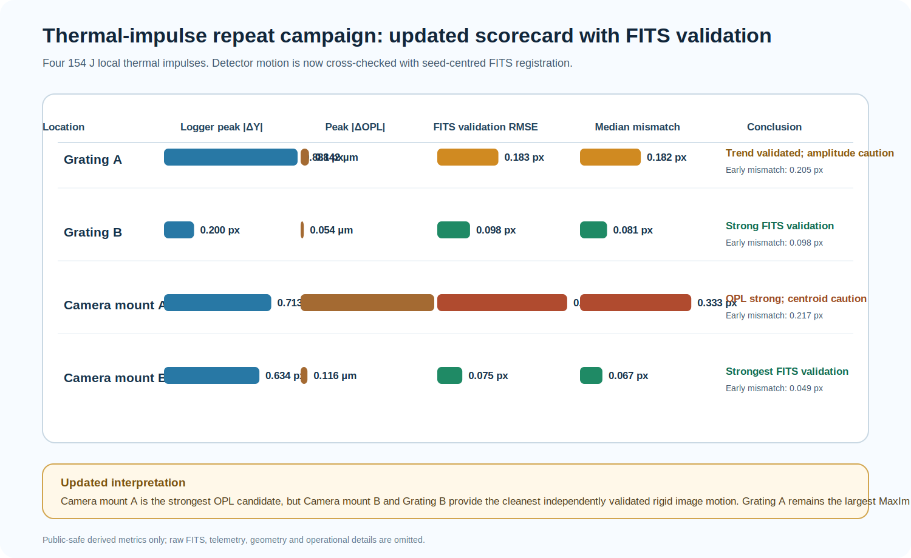

# Local thermal-impulse repeat campaign: 22-24 June 2026

> **Status:** updated component-sensitivity and FITS-validation report.  
> **Trials acquired:** 22-23 June 2026.  
> **Initial consolidation:** 24 June 2026.  
> **FITS cross-correlation validation added:** 24 June 2026.  
> **Purpose:** identify accessible regions whose local thermal perturbation produces a reproducible optical-path-length (OPL) or detector-centroid response before assigning component-specific coefficients to a stability model.

## Summary

This is a **four-location local-thermal impulse comparison**, not a final root-cause claim.

- Every trial received the same nominal electrical pulse: **2.20 W for 70 s = 154 J**.
- The largest logger-recorded detector-plane response remained **Grating A**, with a baseline-detrended post-pulse peak of **|ΔY| = 0.888 px**.
- The largest logger-recorded OPL response remained **Camera mount A**, with **|ΔOPL| = 2.273 µm**.
- A new independent FITS-frame replay now separates **validated rigid image translation** from cases where the tracked image feature changes brightness or shape.
- The strongest MaxIm-to-FITS agreement is found for **Camera mount B** and **Grating B**.
- **Grating A** is supported as a real drift trend, but its fitted amplitude differs between MaxIm and seed-centred FITS replay.
- **Camera mount A** is a strong OPL-sensitivity candidate, but its later large centroid excursion is not fully validated as a rigid detector translation.

**Decision:** the campaign now identifies three distinct outcomes: **Camera mount A** as the strongest OPL-response candidate, **Grating A** as the largest observed MaxIm centroid-response candidate, and **Camera mount B / Grating B** as the cleanest independently validated rigid-image-motion cases. It does **not** yet prove a unique unstable component.

---

## 1. Experimental question

The experiment asked:

> When the same short thermal input is applied at different accessible regions, which location produces the largest and cleanest change in OPL and detector centroid?

The reference-relative centroid coordinates are

$$
\Delta X(t)=X(t)-X_{\mathrm{ref}},
\qquad
\Delta Y(t)=Y(t)-Y_{\mathrm{ref}},
$$

with radial detector-plane response

$$
r(t)=\sqrt{\Delta X(t)^2+\Delta Y(t)^2}.
$$

The interferometric quantity is the baseline-relative optical-path response:

$$
\Delta\mathrm{OPL}(t)=\mathrm{OPL}(t)-\mathrm{OPL}_{\mathrm{baseline}}(t).
$$

For centroid and OPL response amplitudes, a linear pre-pulse trend was removed before calculating peaks. This prevents pre-existing drift from being counted as heater response.

---

## 2. Pulse protocol and supplied energy

Each trial used the same nominal electrical heating impulse:

$$
P=8.80\ \mathrm{V}\times0.25\ \mathrm{A}=2.20\ \mathrm{W},
$$

$$
E_{\mathrm{pulse}}=P\Delta t=(2.20\ \mathrm{W})(70\ \mathrm{s})=154\ \mathrm{J}.
$$

The sequence was:

1. nominal 15-minute baseline;
2. 70-second local heater pulse;
3. passive relaxation while centroid, OPL, TEC, ECU and BME channels continued to log.

### Important temperature interpretation

The experiment controlled **electrical energy**, not the surface temperature of the heated component. A local component-temperature rise was not measured directly. ECU and BME temperatures provide environmental context, while the camera-temperature channel is treated as a health/context diagnostic until its timing and calibration relative to the camera mount are independently verified.

| Location | Trial identifier | Date | Baseline samples | Relaxation samples | Usable duration (min) |
|---|---|---|---:|---:|---:|
| Grating A | `GRATING_A_R01_20260622_133547` | 22 June | 23 | 16 | 26.35 |
| Grating B | `GRATING_B_R01_20260622_144720` | 22 June | 23 | 47 | 46.30 |
| Camera mount A | `CAMERA_MOUNT_RIGHT_A_R01_20260623_123149` | 23 June | 23 | 47 | 46.26 |
| Camera mount B | `CAMERA_MOUNT_B_LEFT_R01_20260623_140332` | 23 June | 23 | 11 | 23.29 |

Only two science frames occurred during the 70-second pulse itself. These trials therefore constrain the **delayed thermal response**, not the sub-minute heating transient.

---

## 3. Baseline quality before heating

The baseline must be evaluated before interpreting a response. A large pre-pulse scatter or slope means that a later apparent response may contain both heating and pre-existing drift.

| Location | Baseline ΔY slope (px min⁻¹) | Baseline σΔY (px) | Baseline assessment |
|---|---:|---:|---|
| Grating A | -0.0499 | 0.1208 | Centroid baseline was already drifting/noisy; large response requires FITS validation and repeat confirmation. |
| Grating B | +0.0136 | 0.0103 | Cleanest centroid baseline. |
| Camera mount A | +0.0185 | 0.0196 | Good centroid baseline before the later environmental evolution. |
| Camera mount B | -0.0166 | 0.0584 | Moderate baseline scatter; short run prevents a full recovery assessment. |

---

## 4. Logger-measured response to the common 154 J impulse

The table below gives the baseline-detrended logger result before independent FITS validation.

| Location | Peak abs(ΔY) (px) | Time to abs(ΔY) peak (min) | Peak radial response (px) | Peak abs(ΔOPL) (µm) | Final ΔY (px) | Final ΔOPL (µm) |
|---|---:|---:|---:|---:|---:|---:|
| Grating A | **0.888** | 11.43 | **1.047** | 0.142 | +0.888 | +0.134 |
| Grating B | 0.200 | 31.39 | 0.283 | 0.054 | +0.200 | -0.041 |
| Camera mount A | 0.713 | 20.42 | 0.941 | **2.273** | +0.233 | +2.273 |
| Camera mount B | 0.634 | **8.38** | 0.652 | 0.116 | +0.634 | -0.116 |

### Direct answer: largest logger-recorded pixel jump

The largest logger-recorded detector-plane deviation was **Grating A**:

$$
|\Delta Y|_{\max}=0.888\ \mathrm{px},
\qquad
r_{\max}=1.047\ \mathrm{px}.
$$

Ranked by logger-recorded peak |ΔY|:

$$
\text{Grating A} > \text{Camera mount A} > \text{Camera mount B} > \text{Grating B}.
$$

### Direct answer: largest OPL response

Camera mount A gave the largest observed OPL excursion:

$$
|\Delta\mathrm{OPL}|_{\max}=2.273\ \mu\mathrm{m}.
$$

This makes Camera mount A a high-priority OPL-sensitivity candidate. It should not be used alone as proof of the largest rigid image translation because its FITS validation is weaker than for Camera mount B and Grating B.

---

## 5. Independent FITS-frame validation of centroid motion

The saved FITS frames were replayed independently to test whether the MaxIm centroid record corresponded to a real image translation.

The validated replay used:

- the exact MaxIm seed coordinate for each test;
- a 160 × 160 px seed-centred FITS crop;
- a median reference from the first five baseline FITS frames;
- baseline-relative shifts after the same pre-pulse reference convention;
- `normalization=None` in the final all-frame replay;
- a Fourier synthetic self-test for registration sign and scale.

All available science FITS frames were processed and no FITS frame was missing.

| Location | FITS frames validated | MaxIm seed (x, y) px | Self-test | All-post RMSE (px) | All-post median mismatch (px) | Early median mismatch (px) | Validation status |
|---|---:|---:|---|---:|---:|---:|---|
| Grating A | 41 | (3959.233, 2982.609) | pass | 0.183 | 0.182 | 0.205 | Real drift trend supported; amplitude differs. |
| Grating B | 72 | (3959.552, 2983.570) | pass | 0.098 | 0.081 | 0.098 | Strong validation. |
| Camera mount A | 72 | (3963.637, 2981.505) | pass | 0.389 | 0.333 | 0.217 | Caution: later feature-shape/intensity effects likely. |
| Camera mount B | 36 | (3960.598, 2983.785) | pass | 0.075 | 0.067 | 0.049 | Strongest validation. |

### Validation interpretation

The FITS replay changes the scientific reading:

- **Camera mount B:** the MaxIm centroid trend is strongly corroborated by the saved images. This is the cleanest rigid-translation validation.
- **Grating B:** the centroid response is also strongly corroborated, although it remains a smaller-amplitude logger response than Grating A.
- **Grating A:** the time evolution and direction are supported by FITS replay, but the amplitude differs; it is a real drift candidate, not yet a calibrated component coefficient.
- **Camera mount A:** the OPL response is real and large, but the late centroid excursion is not cleanly reproduced as a rigid translation. The tracked feature likely changed brightness or shape during the later part of the record.

---

## 6. Early heater response versus later relaxation

The early-response window is defined as the 70-second heater pulse plus the first five minutes after heater-off. This separates the direct local thermal impulse from later environmental or relaxation drift.

| Location | MaxIm early peak abs(ΔY) (px) | FITS early peak abs(ΔY) (px) | MaxIm post peak abs(ΔY) (px) | FITS post peak abs(ΔY) (px) | Reading |
|---|---:|---:|---:|---:|---|
| Grating A | 0.460 | 0.717 | 0.888 | 1.170 | FITS confirms a substantial grating-region image response; amplitude is method-dependent. |
| Grating B | 0.097 | 0.180 | 0.200 | 0.531 | Smaller MaxIm response but strong independent FITS trend. |
| Camera mount A | 0.073 | 0.106 | 0.713 | 0.596 | Early response is small; later behaviour is dominated by non-rigid or environmental evolution. |
| Camera mount B | 0.495 | 0.375 | 0.634 | 0.512 | Clean, fast, independently validated image response. |

This table is now the safest basis for the report. It prevents the later Camera mount A excursion from being misinterpreted as a clean immediate heater response.

---

## 7. Temperature, pressure and humidity context

The table below gives the post-pulse span of each contextual channel relative to its own baseline. These values describe the environmental envelope during the response; they are not local heated-surface temperatures.

| Location | TEC span (°C) | ECU ΔT span (°C) | BME ΔT span (°C) | ECU/BME ΔP span (hPa) | ECU/BME ΔRH span (%) |
|---|---:|---:|---:|---:|---:|
| Grating A | 0.013 | 0.035 | 0.060 | 0.12 / 0.07 | 0.93 / 2.51 |
| Grating B | 0.011 | 0.121 | 0.460 | 0.66 / 0.55 | 3.91 / 7.00 |
| Camera mount A | 0.034 | 0.562 | 1.060 | 0.34 / 0.38 | 7.80 / 20.96 |
| Camera mount B | 0.011 | 0.009 | 0.340 | 0.10 / 0.07 | 4.21 / 8.01 |

### Reading the environmental table

- **Grating A:** the recorded TEC, ECU and BME temperature spans were small, which makes its large pixel response interesting; however, its centroid baseline was not clean and it must be repeated.
- **Camera mount A:** the largest OPL response appeared together with the largest BME temperature and humidity evolution. This is a sensitivity signal, not a clean local-causality measurement.
- **Camera mount B:** rapid centroid motion occurred while humidity also changed substantially; its record ended too early for recovery.
- **Grating B:** the MaxIm response was smaller, but the FITS replay validates that the saved images contained real motion.

---

## 8. Descriptive post-pulse correlation diagnostics

The following are **zero-lag Pearson correlations** between detrended ΔY and the indicated post-pulse variable. They are included because they help identify co-evolution, not because they prove mechanism.

| Location | Pearson r: ΔY vs ΔOPL | Pearson r: ΔY vs BME ΔT | Pearson r: ΔY vs BME ΔP | Pearson r: ΔY vs BME ΔRH |
|---|---:|---:|---:|---:|
| Grating A | +0.980 | -0.888 | +0.897 | +0.187 |
| Grating B | -0.512 | +0.830 | -0.739 | +0.432 |
| Camera mount A | -0.288 | -0.364 | +0.264 | -0.488 |
| Camera mount B | -0.852 | -0.887 | -0.979 | -0.981 |

These coefficients should **not** be used as sensitivity coefficients in a model yet. Each series is short, several variables evolve monotonically with time, and thermal/optical response lags may differ by minutes.

---

## 9. Quality limits before using these data in a controller model

### 9.1 No complete recovery or settling-time result

No trial demonstrated a complete return to the strict post-pulse stability band in the recorded interval. Therefore:

- quoted peak values are lower bounds for records still evolving at the end;
- no physical thermal time constant should be fitted from these four runs alone;
- neither Camera mount B nor Grating A can be described as fully recovered.

### 9.2 FITS validation is now available, but not uniform

The independent image validation confirms that saved FITS frames can recover real image motion. However, agreement is location-dependent:

- Camera mount B and Grating B are strongly validated.
- Grating A is trend-validated but amplitude-limited.
- Camera mount A is OPL-important but centroid-cautionary.

### 9.3 The camera is an investigation priority, not yet a verdict

Camera mount A is important because it produced the largest OPL excursion. However, the strongest logger-recorded pixel jump was at Grating A, while the cleanest independently validated centroid motion occurred for Camera mount B and Grating B. The correct present conclusion is therefore:

> The campaign identifies a **camera-mount OPL-sensitivity candidate**, a **grating centroid-response candidate**, and two **strongly FITS-validated image-motion cases**. It does not yet isolate a unique culprit.

---

## 10. Controlled repeat plan

The next experiment should distinguish a local thermal effect from ambient environmental drift.

1. Repeat **Grating A**, **Grating B**, **Camera mount A** and **Camera mount B** with the same seed-centred FITS validation from the start.
2. Preserve the 154 J pulse initially so amplitudes remain comparable.
3. Extend relaxation until the response stays inside a declared band for at least three accepted frames.
4. Add a temperature sensor physically representative of the heated region; ambient BME/ECU channels are not a substitute for local surface or mount temperature.
5. Include a matched unheated control sequence under comparable room conditions.
6. Report early response separately from late relaxation/environmental drift.
7. Use the all-frame seed-centred FITS replay as a mandatory validation layer before converting MaxIm centroid values into component-specific coefficients.

---

## 11. Engineering conclusion

The 22-24 June campaign provides a useful first **component-sensitivity map**:

$$
\text{Grating A} \rightarrow \text{largest logger-recorded pixel jump},
$$

$$
\text{Camera mount A} \rightarrow \text{largest OPL response},
$$

$$
\text{Camera mount B and Grating B} \rightarrow \text{cleanest FITS-validated image motion}.
$$

The next scientific step is not to declare one component as the cause. It is to repeat the high-priority sites under tighter environmental control, complete the relaxation window, and keep seed-centred FITS replay as the independent validation standard. Only then can reproducible component-specific sensitivity coefficients be considered for the hybrid feedback model.

## Public boundary

This public report contains the protocol, baseline assessment, response amplitudes, environmental spans, FITS-validation summary, descriptive correlation diagnostics and engineering interpretation. It intentionally omits raw telemetry, FITS files, component geometry, sensor positions, optical alignment, hardware communications, calibration matrices, heater placement details and operational controller settings.
