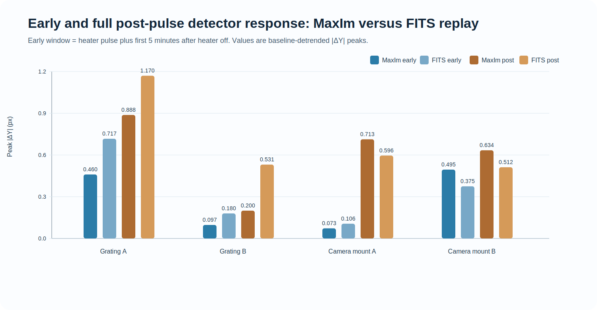

# Local thermal-impulse component-sensitivity campaign: 22-24 June 2026

> **Status:** corrected location interpretation and added explicit location naming.  
> **Purpose:** compare four accessible thermal-perturbation locations, identify where the optical path and detector image are most sensitive, and relate the results to hardware and feedback-control limitations.

## Summary

This campaign used four nominally identical local thermal pulses. The conclusion should not be read as **Camera B** or **Grating B** being the main hardware culprits. Those two locations are useful comparison/validation runs. The main sensitivity locations are:

- **Grating A (G2):** largest measured detector-plane response.
- **Camera mount A / camera right mount:** largest optical-path-length (OPL) response.
- **Camera mount B and Grating B:** smaller response locations; they also provide cleaner FITS-vs-logger agreement, which validates the measurement pathway rather than making them the largest-response locations.

Every location received a nominal **2.20 W for 70 s** electrical pulse, equivalent to **154 J**. The combined result is therefore:

> **Grating A is the priority detector-motion sensitivity location. Camera mount A is the priority OPL-sensitivity location. Camera mount B and Grating B are not the main culprits in this campaign.**

**Status key used below:** 🟢 strong/validated, 🟠 caution/needs careful interpretation, 🔴 high sensitivity or highest-risk response.

---

## 1. Location naming correction

The earlier wording was confusing because the report separated **response amplitude** from **FITS-validation cleanliness**.

| Report label | Trial identifier | Physical description used here | Role in interpretation |
|---|---|---|---|
| **Grating A (G2)** | `GRATING_A_R01_20260622_133547` | Grating-side heater position shown in the G2 photograph | Largest detector-plane response |
| **Camera mount A / camera right mount** | `CAMERA_MOUNT_RIGHT_A_R01_20260623_123149` | Camera-right mount heater position shown in the photograph | Largest OPL response |
| Camera mount B | `CAMERA_MOUNT_B_LEFT_R01_20260623_140332` | Camera-left / second camera mount test | Smaller response; strong validation |
| Grating B | `GRATING_B_R01_20260622_144720` | Second grating-side test | Smaller logger response; strong validation |

The statement that **Camera mount B** and **Grating B** have the strongest FITS agreement means that their logged image shifts are reproduced most cleanly as rigid image translations. It does **not** mean they produced the largest physical response.

---

## 2. Photographic location reference

The two priority locations supplied for the report are:

1. **Grating A (G2)** — the grating-side heater location.
2. **Camera mount A / camera right mount** — the camera-right heater location.

The photographs should be used only as location-reference images. They are not raw measurement data and should not be used to infer detailed optical geometry, exact path length, or sensor placement.

---

## 3. Experimental question

> When the same short thermal input is applied at different accessible regions, which location produces the largest and cleanest optical-path-length response and detector-image response?

The baseline-referenced image coordinates are

$$
\Delta X(t)=X(t)-X_{\mathrm{ref}},
\qquad
\Delta Y(t)=Y(t)-Y_{\mathrm{ref}},
$$

with radial image displacement

$$
r(t)=\sqrt{\Delta X(t)^2+\Delta Y(t)^2}.
$$

The optical-path response is

$$
\Delta\mathrm{OPL}(t)=\mathrm{OPL}(t)-\mathrm{OPL}_{\mathrm{baseline}}(t).
$$

Before calculating response peaks, the linear pre-heater trend was removed. This avoids counting pre-existing drift as a heater response.

---

## 4. Applied thermal pulse and data coverage

The electrical input was held constant between locations:

$$
P=8.80\ \mathrm{V}\times0.25\ \mathrm{A}=2.20\ \mathrm{W},
$$

$$
E=P\Delta t=(2.20\ \mathrm{W})(70\ \mathrm{s})=154\ \mathrm{J}.
$$

Each run contained a pre-heater baseline, a 70 s pulse, and a passive post-heater observation period.

| Location | Trial identifier | Accepted baseline frames | Accepted relaxation frames | Accepted-record span (min) |
|---|---|---:|---:|---:|
| Grating A | `GRATING_A_R01_20260622_133547` | 23 | 16 | 26.35 |
| Grating B | `GRATING_B_R01_20260622_144720` | 23 | 47 | 46.30 |
| Camera mount A | `CAMERA_MOUNT_RIGHT_A_R01_20260623_123149` | 23 | 47 | 46.26 |
| Camera mount B | `CAMERA_MOUNT_B_LEFT_R01_20260623_140332` | 23 | 11 | 23.29 |

**Definitions.** Accepted baseline frames are valid science frames before heater-on. Accepted relaxation frames are valid science frames after heater-off; the two frames acquired during the 70 s pulse are excluded from this count. Accepted-record span is the elapsed time from the first accepted baseline frame to the last accepted science frame. It is not a settling time.

Only two science frames occurred during the pulse. The experiment therefore constrains delayed response over minutes more reliably than sub-minute transient behaviour.

---

## 5. Baseline condition before heating

| Location | Baseline dY slope (px min⁻¹) | Baseline dY scatter σ (px) | Status | Interpretation |
|---|---:|---:|---|---|
| Grating A | -0.0499 | 0.1208 | 🟠 Caution | Baseline was already drifting/noisy; amplitude requires caution. |
| Grating B | +0.0136 | 0.0103 | 🟢 Clean baseline | Cleanest pre-heater centroid baseline. |
| Camera mount A | +0.0185 | 0.0196 | 🟢 Clean baseline | Quiet baseline before later environmental evolution. |
| Camera mount B | -0.0166 | 0.0584 | 🟠 Moderate | Moderate baseline scatter; short record. |

Slope is the least-squares change in ΔY per minute during the baseline. Scatter is the standard deviation of accepted baseline ΔY values.

---

## 6. Logger-measured response to the common impulse

The following values are calculated from heater-on until the last accepted science frame after removing the pre-heater trend.

| Location | Peak abs dY (px) | Time to peak (min) | Peak radial response (px) | Peak abs dOPL (µm) | Terminal dY (px) | Terminal dOPL (µm) | Status |
|---|---:|---:|---:|---:|---:|---:|---|
| **Grating A** | **0.888** | 11.43 | **1.047** | 0.142 | +0.888 | +0.134 | 🔴 Largest detector-plane response |
| Grating B | 0.200 | 31.39 | 0.283 | 0.054 | +0.200 | -0.041 | 🟢 Small logger response |
| **Camera mount A** | 0.713 | 20.42 | 0.941 | **2.273** | +0.233 | +2.273 | 🔴 Largest OPL response |
| Camera mount B | 0.634 | **8.38** | 0.652 | 0.116 | +0.634 | -0.116 | 🟠 Fast image response |

**Interpretation.** Grating A has the largest logger-recorded detector response, whereas Camera mount A has the largest OPL response. These are different observables and should not be collapsed into a single-root-cause statement.

---

## 7. Independent FITS validation of image motion

The logger centroid trace was checked independently using saved FITS frames. The replay used the exact MaxIm seed for each trial, a seed-centred crop, a median image from the first five baseline FITS frames, all available science frames, and a Fourier synthetic-shift self-test.

| Location | FITS frames checked | Self-test | All-post discrepancy RMS (px) | Typical all-post discrepancy (px) | Early-window discrepancy (px) | Status | Interpretation |
|---|---:|---|---:|---:|---:|---|---|
| Grating A | 41 | pass | 0.183 | 0.182 | 0.205 | 🟠 Trend validated | FITS supports the drift trend; measured amplitude differs from MaxIm. |
| Grating B | 72 | pass | 0.098 | 0.081 | 0.098 | 🟢 Strong validation | Strong independent agreement, but smaller response amplitude. |
| Camera mount A | 72 | pass | 0.389 | 0.333 | 0.217 | 🟠 OPL strong, centroid caution | Later feature-shape or intensity change likely affects rigid-shift comparison. |
| Camera mount B | 36 | pass | 0.075 | 0.067 | 0.049 | 🟢 Strongest validation | Strongest independent agreement, but not the largest response. |

**All-post discrepancy RMS** is the root-mean-square radial difference between the MaxIm and independent FITS shifts from heater-on to the final accepted frame; it weights occasional large disagreements strongly. **Typical all-post discrepancy** is the median radial difference in the same interval. **Early-window discrepancy** is the median radial difference during the pulse plus the first five minutes after heater-off.

The validation clarifies the interpretation:

- **Camera mount B** and **Grating B** provide the cleanest evidence that the logger trace corresponds to rigid image translation.
- **Grating A** shows a genuine image-motion trend, but its exact amplitude remains method-dependent.
- **Camera mount A** retains the strongest OPL result, but its later centroid excursion should not be described as a fully validated rigid shift.

---

## 8. Early response versus full recorded response

The early-response window is the 70 s pulse plus the first five minutes after heater-off. The full response includes all accepted non-baseline frames through the final recorded point.

| Location | MaxIm early peak abs dY (px) | FITS early peak abs dY (px) | MaxIm full-record peak abs dY (px) | FITS full-record peak abs dY (px) | Status |
|---|---:|---:|---:|---:|---|
| Grating A | 0.460 | 0.717 | 0.888 | 1.170 | 🔴 Strong grating response |
| Grating B | 0.097 | 0.180 | 0.200 | 0.531 | 🟢 Validated but smaller logger response |
| Camera mount A | 0.073 | 0.106 | 0.713 | 0.596 | 🟠 Late behaviour dominates |
| Camera mount B | 0.495 | 0.375 | 0.634 | 0.512 | 🟢 Fast validated response |

The largest number in a full record is not necessarily the most direct response to the 70 s local pulse. This distinction is particularly important for Camera mount A, where later non-rigid or environmental behaviour contributes strongly.

---

## 9. Environmental context

The values below are post-heater spans: maximum minus minimum accepted value after heater-on. A span is a range across the record; it is neither an average nor a selected point.

| Location | TEC span (°C) | ECU temperature span (°C) | BME temperature span (°C) | ECU/BME pressure span (hPa) | ECU/BME humidity span (%) |
|---|---:|---:|---:|---:|---:|
| Grating A | 0.013 | 0.035 | 0.060 | 0.12 / 0.07 | 0.93 / 2.51 |
| Grating B | 0.011 | 0.121 | 0.460 | 0.66 / 0.55 | 3.91 / 7.00 |
| Camera mount A | 0.034 | 0.562 | 1.060 | 0.34 / 0.38 | 7.80 / 20.96 |
| Camera mount B | 0.011 | 0.009 | 0.340 | 0.10 / 0.07 | 4.21 / 8.01 |

These channels provide context only. They do not directly give the temperature of the heated component, detector mount, grating substrate or camera cooling interface.

### Descriptive correlations

The following zero-lag Pearson coefficients show co-evolution, not causation or calibrated sensitivity coefficients.

| Location | r(dY, dOPL) | r(dY, BME dT) | r(dY, BME dP) | r(dY, BME dRH) |
|---|---:|---:|---:|---:|
| Grating A | +0.980 | -0.888 | +0.897 | +0.187 |
| Grating B | -0.512 | +0.830 | -0.739 | +0.432 |
| Camera mount A | -0.288 | -0.364 | +0.264 | -0.488 |
| Camera mount B | -0.852 | -0.887 | -0.979 | -0.981 |

---

## 10. Hardware interpretation and engineering implications

### Camera-side thermal boundary

The camera is not described as a “leak.” Its cooling system is designed to keep the detector chip cold and improve signal-to-noise ratio. However, continuous cooling makes the camera a persistent thermal boundary: heat is removed at the detector and rejected elsewhere in the camera system. That process can maintain a local temperature gradient in the camera-side structure and nearby air.

Camera mount A produced the largest OPL excursion, **2.273 µm**. This does not prove that camera cooling alone caused the observed drift; no direct camera-mount temperature or heat-flux measurement was made. It does identify the camera-side thermal environment as the first hardware mechanism to characterise and mitigate.

### Measured IDS optical-path geometry

For the Camera mount A run, the IDS-reported optical path had the following raw-log statistics:

| Quantity | Value |
|---|---:|
| Valid OPL samples | 72 |
| Mean OPL | 369274.490 µm = **36.9274 cm** |
| Median OPL | 369274.222 µm = 36.9274 cm |
| Baseline mean OPL (first five valid samples) | 369276.206 µm |
| Standard deviation | 0.816 µm |
| Minimum / maximum | 369273.508 / 369276.385 µm |
| Full raw-log range | 2.877 µm |

The mean IDS-reported path is approximately 36.93 cm. Relative to the earlier approximately 59–60 cm configuration noted in the laboratory history, it is roughly 38% shorter. This comparison is meaningful only after confirming that the historical and present IDS values have the same optical-path definition and pass count; the IDS-reported path must not automatically be treated as a mechanical camera-to-component separation.

For a refractive-index disturbance, the integrated optical-path response scales approximately as

$$
\Delta\mathrm{OPL}\approx L\,\Delta n.
$$

Thus a shorter monitored air path should reduce the integrated contribution of distributed refractive-index fluctuations. Despite this shorter current path, local camera-side heating still produced the largest measured OPL response. This supports the interpretation that local thermal gradients near the detector-side assembly are now at least as important as the total free-space path length.

### Grating-side sensitivity

Grating A produced the largest logger-recorded detector response and a FITS-supported drift trend. The grating and mount remain a second high-priority thermal-sensitivity region. Camera-side mitigation alone should not be assumed to remove all detector drift.

### Practical implication

The immediate engineering question is not whether to abandon feedback, but how to reduce the disturbance that feedback must reject. The current evidence supports:

1. characterising the camera-side thermal gradient at the intended detector/chiller operating point;
2. reducing thermal coupling between the cooling boundary and nearby optical path through local insulation, enclosure refinement or airflow management;
3. retaining grating-side sensitivity as a second hardware issue;
4. preserving adaptive model identification, TEC-primary correction and AO fine trim after the local thermal load has been reduced.

A controller can compensate a disturbance only after it is measured and after the delayed actuator has authority. Hardware mitigation should reduce the size and rate of the disturbance so that the controller spends more time inside the desired detector-error band.

---

## 11. Conclusion

The campaign identifies two hardware directions rather than a single final culprit:

- **Camera mount A / camera right mount:** strongest OPL-sensitivity candidate, with a 2.273 µm full-record OPL response despite a mean IDS-reported path of only 36.93 cm.
- **Grating A (G2):** largest logger-recorded image-motion candidate, with a FITS-supported trend but method-dependent amplitude.

Camera mount B and Grating B provide the strongest agreement between MaxIm and FITS image translation. They validate the measurement pathway used to distinguish genuine detector motion from changes in feature brightness or shape, but they are not the largest-response locations in this campaign.

The feedback loop remains valuable and has demonstrated stable operation in earlier long-duration experiments. The limiting problem is that EXOhSPEC is a distributed thermal-optical system with delayed and changing sensitivities. Reducing the camera-side and grating-side thermal disturbances at hardware level should allow the adaptive TEC-primary and AO-fine-trim strategy to operate closer to its demonstrated capability.

## Public boundary

This public report contains derived response metrics, validation statistics, location naming clarification, and engineering interpretation. It intentionally omits raw telemetry, FITS files, detailed component geometry, sensor positions, optical alignment, hardware communications and operational controller settings.
