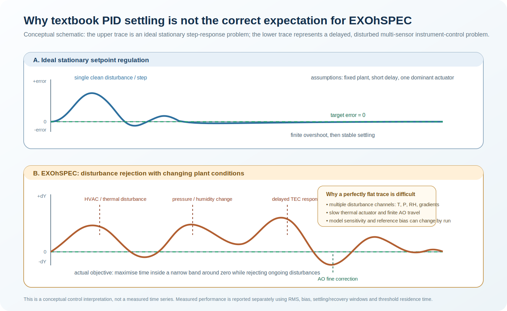
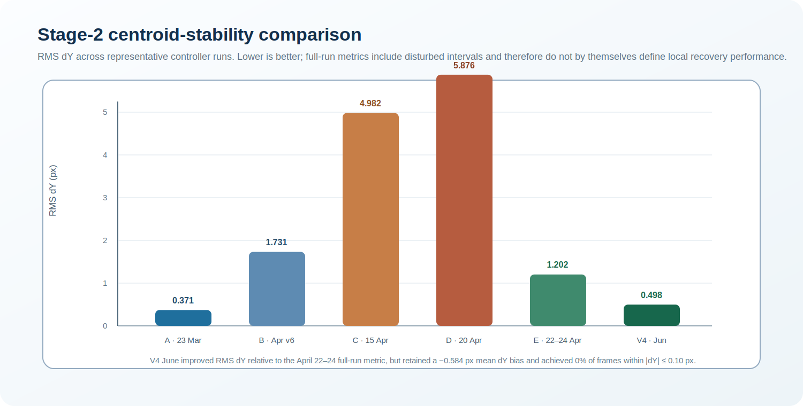

# Why perfect zero-pixel regulation was not yet achieved

## 1. Control objective

The practical objective is not a single textbook step response. The controller must maintain the spectral image close to its reference position for many hours while the spectrograph is exposed to changing environmental conditions:

$$
\Delta x(t) \approx 0, \qquad \Delta y(t) \approx 0.
$$

The preferred fine-stability region is:

$$
|\Delta y(t)| \leq 0.10\ \mathrm{px}.
$$

A conventional PID illustration assumes a fixed plant, one dominant actuator, one setpoint change and negligible continuing disturbance. EXOhSPEC is instead a delayed, multi-disturbance, multi-sensor and multi-actuator **disturbance-rejection** problem.

---

## 2. Why the laboratory response differs from an ideal PID curve

The image motion can be represented locally as:

$$
\Delta y_k = \beta_T\Delta T_k + \beta_P\Delta P_k + \beta_H\Delta H_k + \beta_L\Delta L_k + \eta_k.
$$

Here, $\Delta T$, $\Delta P$, $\Delta H$ and $\Delta L$ represent thermal, pressure, humidity and optical-path-length variations. The coefficients are not necessarily constant across runs because the thermal state, optical alignment, HVAC state and actuator history can change.

The controller therefore has to reject disturbances that continue to evolve while the correction is being applied. The relevant physical chain is:

$$
(T,P,H) \longrightarrow n(T,P,H) \longrightarrow \mathrm{OPL} \longrightarrow (\Delta x,\Delta y).
$$

This is not a simple, stationary controller-to-output transfer function.

### 2.1 One slow actuator cannot independently cancel every disturbance

The TEC directly controls an enclosure temperature setpoint. It does not directly command pressure, humidity, refractive index, optical path length or detector centroid. Temperature correction can therefore compensate only the component of the image drift that is thermally coupled to the controlled region.

This is visible in the long-run OPL benchmark: the image-plane behaviour could remain bounded while OPL residuals still grew under a substantial pressure disturbance. The result is consistent with a system in which thermal control suppresses part of the disturbance but cannot eliminate all pressure- and humidity-driven refractivity effects.

### 2.2 Thermal lag makes purely reactive correction slow

The TEC has thermal inertia. A command changes the setpoint immediately, but the relevant optical structure and image centroid respond later. A controller that waits until $|\Delta y|$ is already large can therefore chase the disturbance rather than reject it pre-emptively.

The V6b design addresses this with OPL-trend prediction, an adaptive control cadence and a feed-forward term:

$$
\Delta T_{\mathrm{ff},k} = -\frac{\Delta L_k}{g_T}.
$$

The estimate remains dependent on the current run-specific thermal gain $g_T$, time lag and measurement quality.

### 2.3 AO is fast but has finite travel

The active-optics correction is obtained from a measured two-dimensional calibration matrix:

$$
\begin{bmatrix}
\Delta x \\
\Delta y
\end{bmatrix}
=
\mathbf{M}_{\mathrm{AO}}
\begin{bmatrix}
s_x \\
s_y
\end{bmatrix},
\qquad
\mathbf{s}^{\ast} = -\mathbf{M}_{\mathrm{AO}}^{-1}\mathbf{e}.
$$

AO is useful for small residual image motion, but it is not a substitute for coarse thermal correction. Its cumulative travel is bounded. When AO carries persistent drift for too long, it approaches saturation and loses fine-control authority. The TEC must then absorb the offset through an unloading or recentering strategy.

### 2.4 Reference bias can prevent a zero-centred result even when the controller is stable

A measured centroid error is always relative to the selected reference:

$$
\Delta y_k = y_k - y_{\mathrm{ref}}.
$$

In the June V4 experiment, the report identified a mean $dY$ bias of $-0.5837$ px because the reference was acquired at cold start rather than after thermal equilibration. That means the controller could maintain a comparatively narrow distribution around a biased reference while still recording no samples inside the strict $|dY|\leq 0.10$ px band.

This is a reference-definition problem in addition to a control problem. A run-specific reference should be established from a quality-checked late-warm-up window and each subsequent reference adjustment must be logged.

---

## 3. Evidence from the Stage-2 experiments

The Stage-2 comparison shows that the controller architecture improved, but global metrics still depend strongly on the disturbance history of each run.

| Run | RMS dY (px) | Interpretation |
|---|---:|---|
| A, 23 March | 0.371 | Strong early performance by RMS. |
| B, April v6 | 1.731 | Larger residual variation despite improved OPL behaviour. |
| C, 15 April | 4.982 | Fixed-model failure mode. |
| D, 20 April | 5.876 | Fixed-prior model initially stabilised, then entered a sustained negative plateau. |
| E, 22–24 April | 1.202 | Improved long-duration behaviour and recovery relative to the fixed-prior run. |
| V4, 2–3 June | 0.498 | Lower RMS dY with fewer actions, but a systematic mean bias remained. |

The June V4 feedback phase achieved RMS $dX=0.1044$ px and RMS $dY=0.4975$ px. It retained 100% of frames, kept AO cumulative travel within $\pm4$ steps, and required only 45 TEC actions and 42 AO actions during feedback. However, it also had a mean $dY=-0.5837$ px, residual OPL drift of $-0.1818\ \mu\mathrm{m\,h^{-1}}$, and 0% of frames in the strict $|dY|\leq0.10$ px band.

This combination is important: the controller became more economical and more stable in RMS terms, but it did not yet demonstrate long-duration fine regulation about an unbiased zero.

---

## 4. What has been achieved

The experiments already establish several important capabilities:

1. **Environmental coupling is measurable.** Temperature, pressure, humidity, OPL and image centroid are sufficiently linked to motivate feedback rather than passive monitoring alone.
2. **TEC-primary control is necessary.** Large or persistent drift should be dealt with thermally rather than delegated to AO.
3. **AO fine trim is effective.** When the residual is already small, AO can provide faster local image-plane correction.
4. **Adaptive identification is preferable to a fixed prior.** The fixed-prior experiment demonstrated that coefficients can become inaccurate when the current plant state differs from the calibration state.
5. **Range and reference management matter.** AO travel and feedback-zero selection can dominate apparent fine-stability performance.

---

## 5. Remaining limitations

The remaining gap between the present system and long-duration zero-pixel regulation is best described as a set of linked control limitations, not one incorrect PID gain.

| Limitation | Consequence | Required development |
|---|---|---|
| Pressure and humidity disturbances are not independently actuated | OPL can drift even when the TEC is stable | Use OPL/environmental prediction and quantify residual uncorrectable disturbance. |
| Thermal lag | Late TEC commands can chase drift | Improve delay identification, feed-forward and cadence selection. |
| Run-varying sensitivity | Fixed coefficients can apply the wrong sign or magnitude | Estimate the model during warm-up and validate before feedback. |
| Cold-start reference bias | A stable distribution may remain offset from zero | Set feedback zero from a late, quality-gated warm-up segment. |
| Finite AO travel | Fine actuator can saturate during persistent drift | Trigger proactive TEC unloading before AO approaches its travel limit. |
| Measurement and model uncertainty | Controller can react to noise or an imperfect proxy | Use sensor-quality gating, uncertainty logging and raw-image centroid verification. |

---

## 6. What a realistic success plot should show

The most informative performance figure is not an isolated textbook step response. It should show a real disturbance and recovery interval with:

- $dY$ and, where relevant, $dX$ relative to zero;
- shaded $\pm0.10$, $\pm0.20$ and $\pm0.50$ px bands;
- OPL and environmental forcing on aligned time axes;
- TEC commands, AO actions and cumulative AO travel;
- clearly stated phase boundaries, reference changes and excluded samples.

The primary metrics should be RMS error, mean bias, mean absolute error, threshold residence time, recovery/settling time after a defined disturbance, command rate and AO range usage. A final point near zero is useful evidence of recovery, but it is not evidence of continuous fine lock without the associated time-within-band metrics.

---

## 7. Engineering conclusion

Perfectly flat $dX=dY=0$ traces have not yet been achieved because EXOhSPEC is not a stationary, single-actuator PID test bench. It is a delayed spectrograph stabilisation problem with multiple continuing disturbance channels, run-dependent sensitivity, a slow thermal actuator, a fast but range-limited fine actuator, and reference-definition uncertainty.

The next technical objective is therefore not simply more aggressive PID tuning. It is to combine:

$$
\text{adaptive warm-up identification}
+ \text{validated feedback reference}
+ \text{OPL/environment feed-forward}
+ \text{TEC-primary control}
+ \text{AO fine trim with proactive unloading}
+ \text{explicit disturbance-recovery evaluation}.
$$

That strategy is scientifically more defensible than claiming an ideal textbook response, and it provides a measurable route toward longer residence inside the sub-pixel stability band.